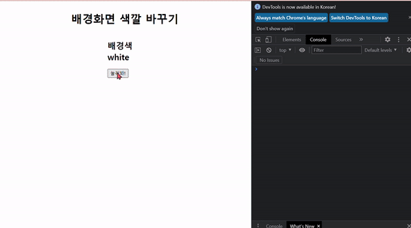

# 💡 **3주차 FE**

> [초보자를 위한 40가지의 자바스크립트 프로젝트](https://www.freecodecamp.org/korean/news/javascript-projects-for-beginners/#how-to-create-a-restaurant-menu-page)
>
> [바닐라 자바스크립트 프로젝트](https://www.youtube.com/watch?v=3PHXvlpOkf4&t=421s)
>
> `1. Color Flipper 만들기`

 

 

# Color Flipper 구현 화면

