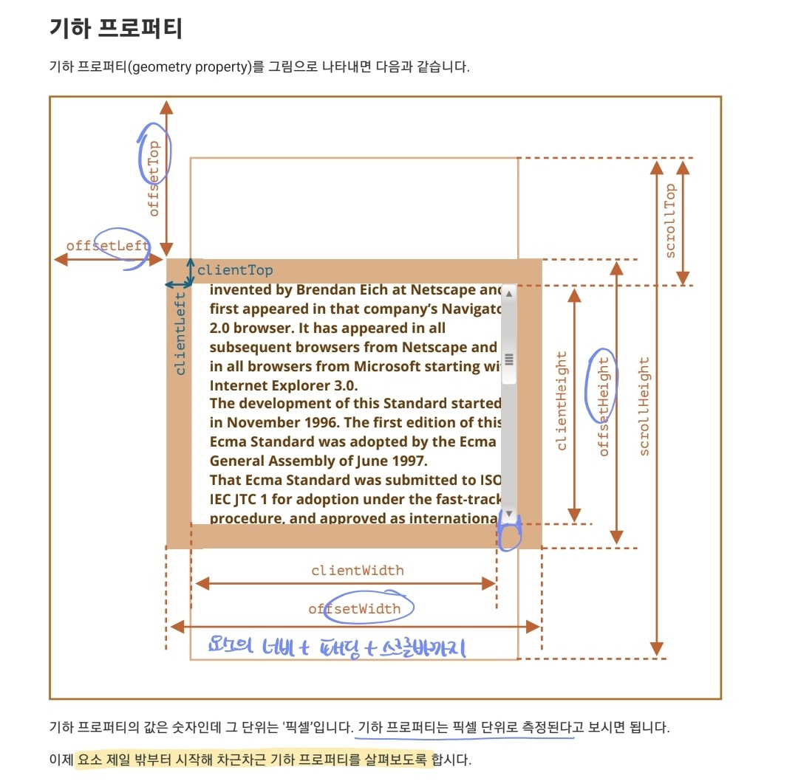
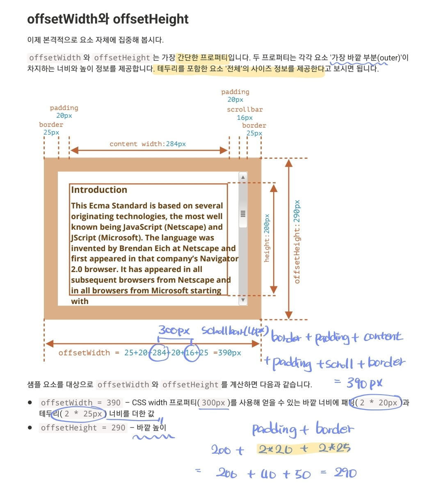
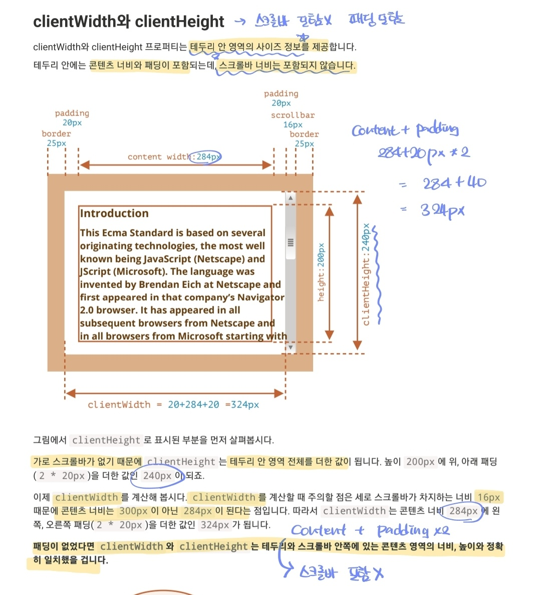
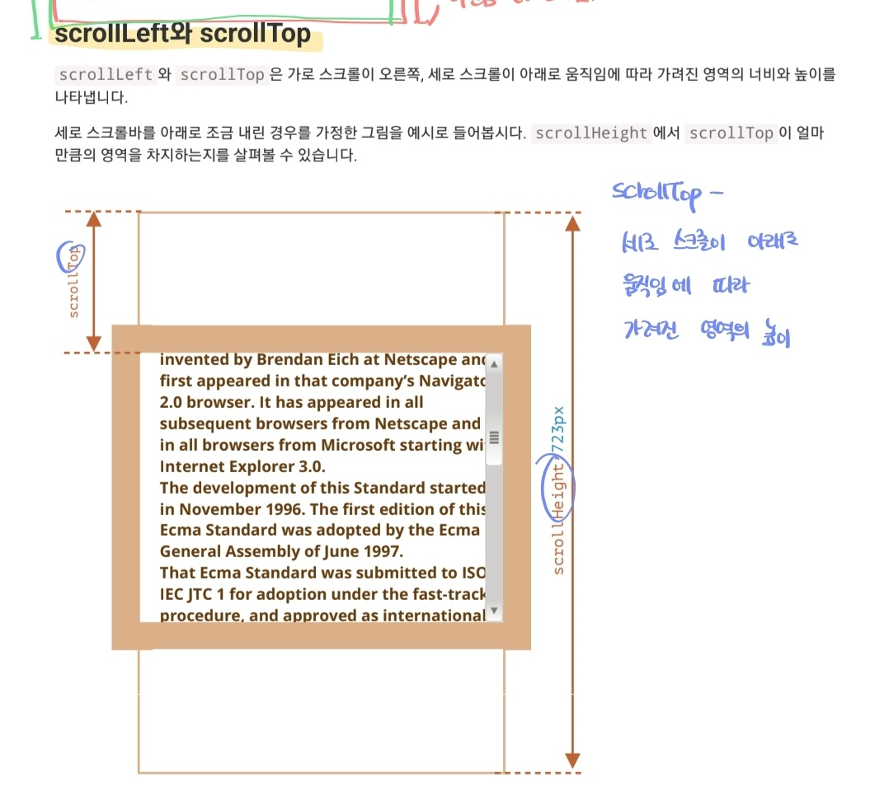

# 2.6. alert, prompt, confirm 을 이용한 상호작용

#### ⚡ 요약

```
브라우저는 사용자와 상호작용할 수 있는 세 가지 함수를 제공
1. alert : 메시지를 보여준다.
2. prompt : 사용자에게 입력 필드를 함께 제공, 확인 누르면 입력값을 반환하고, 취소/Esc를 주르면 null을 반환
3. confirm : 화깅ㄴ 또는 취소를 누를  때까지 창에 보여짐. 확인은 true, 취소는 false를 반환

위 세 개 함수를 통해 띄워지는 모달 창은 대개 브라우저 중앙에 위치하며, 모양을 수정할 수 없음(커스텀 불가)
```

#### 다시 봐야할 부분(12-11)

```
부트스트랩(bootstrap)의 바깥 영역 터치하면 창이 닫히는 효과는 어떻게 구현한 것일까?
```


## 모달?

> 메시지가 있는 작은 창(modal window)

🚫 사용자는 `확인`을 누르기 전까지 모달 창 밖에 있는 버튼을 누른다든가의 행위를 할 수 없음.


## alert

> 확인을 누를 때까지 모달이 계속 떠 있음.

```javascript
alert("FE study");
```


## prompt

> 텍스트 메시지와 입력 필드, 확인 및 취소 버튼이 있는 모달 창 띄워주는 함수

```javascript
result = prompt(title, [default]);
```

- title : 사용자에게 보여줄 문자열
- default : 입력 필드의 초기값(선택값)

```javascript
let age = prompt("오늘은 몇 주차입니까?", "2주차")
```


## confirm

> 질문과 확인 및 취소 버튼이 있는 모달 창을 띄워주는 함수

```javascript
result = confirm(question);
```

사용자가 확인 버튼을 누르면 `treu`, 그 외는 `false` 반환

```javascript
let delete = confirm("정말 삭제하시겠습니까?)
```


# 2.7. 형 변환

#### ⚡ 요약

```
1. 문자형으로 변환 : String(value) - 명시적 형 변환, 주로 무언가를 출력할 때 자동 형 변환
2. 숫자형으로 변환 : Number(value) - 명시적 형 변환, 주로 수학 관련 연산 시 자동 형 변환
3. 불린형으로 변환 : Boolean(value) - 명시적 형 변환, 주로 논리 연산 시 자동 형 변환

숫자형으로 변환시 undefined는 0이 아니라 NaN
문자열의 경우 빈 문자열이 아니라면 다 true를 반환(문자열 "0"과 " " 공백도 불린형으로 변환시 true)
```

#### 

## 형 변환

> 함수와 연산자에 전달되는 값은 대부분 `적절한 자료형`으로 자동 변환된다.

- `alert` 함수가 전달 받은 값을 자료형과 관계 없이 문자열로 자동 변환하여 반환하는 것

- 수학 관련 연산자가 전달 받은 값을 숫자로 변환하는 것

  등등

  

## 문자형으로 변환

>  문자형의 값이 필요할 때 일어남

- `alert` 함수는 매개변수로 문자형을 받기 때문에, 다른 형의 값을 전달 받더라도 문자형으로 변환되어 전달된다. 

- 명시적 형 변환: `String(value)`


## 숫자형으로 변환

> 수학과 관련된 함수의 표현식에서 자동으로 일어남.

- 숫자형이 아닌 값에 나누기 `/`를 적용한 경우

```javascript
alert("6" / "2"); // 3
```

- 명시적 형 변환 : `Number(value)`
  - 숫자 이외의 글자가 들어가 있는 문자열을 숫자형으로 변환하려고 하면, 그 결과는 `NaN`이 된다.

#### 숫자형으로 변환 시 적용되는 규칙

> 숫자형으로 변환시 null은 0 이지만, undefined은 NaN으로 변환된다.

- true false - 1과 0
- `undefined` -` NaN`
- `null` - `0`


## 불린형으로 변환

> 논리 연산을 수행할 때 일어남.

- 직관적으로 **비어있다**고 느껴지는 값들은 `false`를 반환한다.(0, null, undefined, NaN)
- 그 외는 `true`
- 명시적 형 변환 : `Boolean(value)`
- 빈 문자열만 아니면 `true` 반환. 문자열 `"0"` 도 `true` 반환

```javascript
"0"
```


# 2.8. 기본 연산자와 수학

#### 다시 봐야할 부분(12-11)

```
할당 연산자
```


## 용어

- 피연산자(*operand*) - 연산자가 연산을 수행하는 대상이다. 인수(*argument*)라는 용어로 불리기도 한다.
- 단항(*unary*) 연산자 - 피연산자를 **하나만 받는다.** 단항 `-` *마이너스* 연산자는 부호를 뒤집는다. ex) x = -x
- 이항(*binary*) 연산자 - 두 개의 피연산자를 받는다. 이항 `-` 마이너스 연산자는 뺄셈에 쓰인다.


## 수학

수학 연산자

```javascript
덧셈 : +,
뺄셈 : -,
곱셈 : *,
나눗셈 : /,
나머지 : %,
거듭제곱 : **
```

거듭제곱 연산자는 정수가 아닌 숫자에 대해서도 동작한다. `1/2`를 사용하면 제곱근을 구하기도 가능.


## 이항 연산자 `+`와 문자열 연결

> 이항 `+` 연산자의 피연산자로 문자열이 오면 덧셈이 아니라 문자열을 병합한다.

```javascript
let s = "FE" + "Study"; // FEStudy
```

💥`+`를 쓸 때 피연산자 중 하나가 문자열이면 다른 하나도 문자열로 변환된다.

```javascript
alert(2 + 2+ '1'); // '221' 이 아니라 숫자가 먼저 더해지고, 더해진 숫자와 문자열과의 병합으로 '4(2 + 2)1'의 결과가 나타남.
```

뺄셈과 나눗셈 연산자는 피연산자가 숫자형이 아닌 경우에 그 형을 숫자형으로 변환

```javascript
alert(6 - '2'); // 4 '2'를 숫자로 바꾼 후 연산이 진행
alert('6' / '2' ); //2 둘다 숫자로 바뀐 후 연산이 진행
```


## 단항 연산자`+`와 숫자형으로의 변환

> 숫자가 아닌 피연산자에 단항 덧셈 연산자를 붙이면 숫자형으로의 변환이 일어남.

```javascript
alert( +true ); //1;
alert( +"" ); //0
```

명시적 형 변환 함수 `Number(value)`와 동일한 기능


```javascript
let apples = "2";
let oranges = "3";

alert( apples + oranges ); // 23, 이항 덧셈 연산자는 문자열을 연결
```


```javascript
let apples = "2";
let oranges = "3";

// 이항 덧셈 연산자가 적용되기 전 숫자형으로 변환
alert( +apples + +ornages ); // 5 첫 번째와 세 번째 덧셈은 숫자형으로 변환(단항 연산자 +) 가운데 덧셈은 덧셈 연산(숫자끼리의 이항 연산자 +)
=> 단항 연산자의 연산자가 먼저 적용(단항 덧셈 우선순위 17, 덧셈 우선순위 13)
=> Number(apples) + Number(oranges)와 같은 결과(더 간단함)
```


## 증가/감소 연산자

> *변수*에 저장된 숫자를 하나 늘리거나 줄이는 데 자주 사용되는 연산

- 증가 연산자 `++` : 변수를 1씩 증가

```javascript
let counter = 2;
counter ++; counter = counter + 1
alert( counter ); // 3
```

- 감소 연산자 `--` : 변수를 1씩 감소

```javascript
let counter = 2;
counter --; // counter = counter - 1
alert( counter ); // 1
```

🚫 `5++`와 같이 **변수가 아닌 값**에 사용하려고 하면 **에러가 발생**한다.


# 요소 사이즈와 스크롤

> 요소를 움직이거나 특정 좌표에 위치시킬 때 요소의 너비나 높이와 같은 기하정보 관련 프로퍼티를 활용한다.

#### ⚡ 요약

```
1. offsetParent - 위치 계산에 사용되는 가장 가까운 조상 요소(parent) td, th, table, body
2. offsetLeft와 offsetTop - offsetParent 기준으로 요소가 각각 오른쪽, 아래쪽으로 얼마나 떨어져있는지 반환
3. offsetWidth와 offsetHeight - border를 포함한 요소 '전체'가 가지는 너비와 높이
4. clientLeft와 clientTop - 요소 제일 밖을 감싸는 영역과 요소 안(내용 + padding)을 감싸는 영역 사이의 거리를 반환.
5. clientWidth와 clientHeight - content와 padding을 포함한 영역의 너비와 높이, 스크롤바 포함 x
6. scrollWidth와 scrollHeight - clientWidth, clientHeight 같이 content와 padding을 포함한 영역의 너비와 높이를 나타내는데, 스크롤바에 의해 숨겨진 콘텐츠 영역까지 포함됨.
7. scrollLeft와 scrollTop - 스크롤바가 오른쪽, 아래로 움직임에 따라 가려지게 되는 요소 컨텐츠의 너비와 높이

scrollTop과 scorllLeft는 스크롤바를 움직일 수 있다. 그 외의 프로퍼티는 읽기 전용
```

#### 다시 봐야할 부분(12-11)

```
기하 프로퍼티 부분은 한 눈에 볼 수 있으므로 계속 다시 보는 게 좋을 것 같다.
```


## 기하 프로퍼티



## offsetParent와 offsetLeft, offsetTop

> offset은 요소가 화면에서 차지하는 영역 전체 크기를 말한다. 요소의 너비와 높이에 padding, 스크롤바, border를 합친 크기이며 margin은 포함되지 않는다.

- `offsetParent` : 좌표 계산에 사용되는 가장 가까운 조상 요소의 참조를 반환한다.
- offsetLeft, offsetTop 은 offsetParent를 기준으로 각각 요소가 오른쪽으로, 아래쪽으로 얼마나 떨어져 있는지를 나타낸다.

- offsetParent가 null일 수도 있다.


## offsetWidth와 offsetHeight

> border를 포함한 요소 전체의 사이즈 정보를 제공



```
요소의 display가 none이거나 문서 내에 해당 요소가 없으면 모든 기하 프로퍼티의 값은 0이 된다.
```


## clientWidth와 clientHieght

> 테두리 안 영역의 사이즈 정보를 제공(padding은 포함되지만, 스크롤바 너비는 포함하지 않음)



- padding이 없다면 clientWidth와 clientHeight을 사용해 콘텐츠 영역 크기를 구할 수 있다.


## scrollWidth와 scrollHeight

> 스크롤바에 의해 감춰진 영역도 포함한다.


## scrollLeft와 scrollTop

> 가로 스크롤이 오른쪽, 세로 스크롤이 아래로 움직임에 따라 가려진 여역의 너비와 높이를 나타냄(padding 포함)

- scrollTop : overflow됨에 따라(세로 스크롤바에 의해) 가려져 보이지 않는 *위쪽 컨텐츠의 높이가* 된다.



## `getComutedStyle` 함수로 요소의 너비와 높이를 구하면 부정확할 수 있다.

> 기하 프로퍼티로 구할 것


# 좌표

## 창 기준

> 창 맨 위(window) 왼쪽 모서리를 기준으로 좌표를 계산

- `clientX/clientY`로 표시한다.

## 문서 기준

> 문서 최 상단에서 문저 맨 위 왼쪽 모서리를 기준으로 좌표를 계산

- `pageX/pageY`로 표시한다.


- 문서 기준 좌표는 변경되지 않지만, 창 내 요소는 움직이기 때문에 창 기준 요소 좌표는 변경된다.
- `pageY` : 스크롤 후 값이 전과 동일하다.
- `clientY` : 문서가 스크롤 되면서 해당 지점이 창 상단과 가까워졌기 때문에 창 기준 좌표는 변경(화살표가 짧아짐)


## getBoundgingClientRect로 요소 좌표 얻기

#### 프로퍼티

- x와 y : *창 기준* 요소를 감싸는 div의 x, y 좌표
- width와 height : 요소를 감싸는 네모의 너비, 높이


이를 이용해 요소가 화면에 들어왔을 때와 화면에서 벗어났을 때의 상태를 제어할 수 있다.

- 아래에서 위로 올라오는 요소의 경우 화면에 들어왔을 때 `getBoundingClientRect().top` 기준으로 그 좌표가 유저의 화면 높이(`document.documentElement.clientY`)와 같아진다.

```javascript
    // 디테일 리모컨바
    const commentSection = document.querySelector('.comment-section')
    const nav = document.querySelector('#test')
    document.addEventListener('scroll', function () {
        const header1 = document.querySelector('.detail-meta-section')
        if (header1.getBoundingClientRect().top < 0 && commentSection.getBoundingClientRect().top > document.documentElement.clientHeight) {
            nav.classList.add('fix');
            nav.style.visibility = "visible"
            nav.classList.remove('removed');
        } else {
            nav.classList.remove('fix');
            nav.classList.add('removed');
        }
    })
```


- 사용자가 헤더와 댓글창 사이를 보고 있을 때만 등장하는 댓글창 리모컨 구현(헤더와 댓글창이 화면을 벗어났을 때)

.gif)