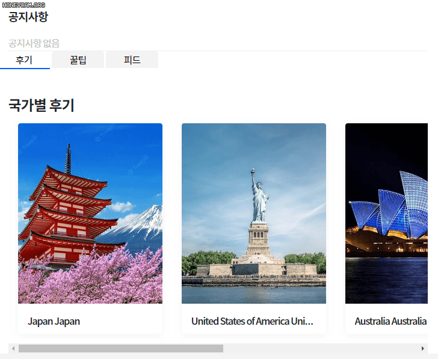

# 토이 프로젝트(1) - 서로 다른 내용을 보여주는 탭 만들기



```
후기/꿀팁/피드 버튼을 눌러서 각각 다른 내용(국가별 후기/국가별 꿀팁/국가별 피드)을 나오도록 한다.
```


## main.html

### html 구조

```
<article.main-about // 탭 영역 전체를 담을 div

	<div.main-btn-container // 버튼만 담아놓을 container
		button.main-tab-btn(main-active) // 초기값이므로
		button.main-tab-btn
		button.main-tab-btn
   div.main-bran-container>
   
   <article.main-about-content // 버튼에 따라 달라질 숨겨질/보여질 영역
   		section.main-content(main-active) // 초기값
   		section.main-content
   		section.main-content
    article.main-about-content>
    
article.main-about>
```


### 로직

```
버튼마다 data-id를 주고 버튼을 누를 때마다 발생한 이벤트에 담겨있는 data-id로 매칭되는 컨텐츠의 id 값의 영역을 classList를 이용하여 숨기고 보여지게 한다.
```


```html
<article class="main-about">
    <div class="main-btn-container">
      <button class="main-tab-btn main-active" data-id="review">
        후기
      </button>
      <button class="main-tab-btn" data-id="advice">
        꿀팁
      </button>
      <button class="main-tab-btn" data-id="feed">
        피드
      </button>
    </div>

    <article class="main-about-content">
      <!-- 후기 -->
      <section id="review" class="main-content main-active" style="margin-top: 45px; padding: 0 18px">
        <h2 style="font-size: 19px; max-width: 732px; margin: 0 auto; font-weight: 700; ">국가별 후기</h2>
        <div style="max-width: 733px; margin: 0 auto; display: flex; white-space: nowrap; overflow-x: scroll;">
          
          <div class="sc-gSQFLo eYZFXY" style="min-width: 240px; max-height: 350px; background-color: white;">
            <a class="sc-jgrJph dYjA-dM" href="">
              </a>
            <div class="sc-lbhJGD jhNfXV">
              <a class="sc-jgrJph dYjA-dM" href="">
                <h4>{{ country.country_name }}
                  {{ country.country_eng_name }}</h4>
              </a>
            </div>
            <div class="sc-iNGGcK UXOKy">
              <a class="userinfo" href="">
                <span>by
                  <b>{{ country.country_eng_name }}</b></span></a>
            </div>
          </div>
          
        </div>
      </section>

      <!-- 꿀팁 -->
      <section id="advice" class="main-content" style="margin-top: 45px; padding: 0 18px">
        <h2 style="font-size: 19px; max-width: 732px; margin: 0 auto; font-weight: 700; ">국가별 꿀팁</h2>
        <div style="max-width: 733px; margin: 0 auto; display: flex; white-space: nowrap; overflow-x: scroll;">
          
          <div class="sc-gSQFLo eYZFXY" style="min-width: 240px; max-height: 350px; background-color: white;">
            <a class="sc-jgrJph dYjA-dM" href="">
              </a>
            <div class="sc-lbhJGD jhNfXV">
              <a class="sc-jgrJph dYjA-dM" href="">
                <h4>{{ country.country_name }}
                  {{ country.country_eng_name }}</h4>
              </a>
            </div>
            <div class="sc-iNGGcK UXOKy">
              <a class="userinfo" href="">
                <span>by
                  <b>{{ country.country_eng_name }}</b></span></a>
            </div>
          </div>
          
        </div>
      </section>

      <!-- 피드 -->
      <section id="feed" class="main-content" style="margin-top: 45px; padding: 0 18px">
        <h2 style="font-size: 19px; max-width: 732px; margin: 0 auto; font-weight: 700; ">국가별 피드</h2>
        <div style="max-width: 733px; margin: 0 auto; display: flex; white-space: nowrap; overflow-x: scroll;">
          
          <div class="sc-gSQFLo eYZFXY" style="min-width: 240px; max-height: 350px; background-color: white;">
            <a class="sc-jgrJph dYjA-dM" href="">
              </a>
            <div class="sc-lbhJGD jhNfXV">
              <a class="sc-jgrJph dYjA-dM" href="">
                <h4>{{ country.country_name }}
                  {{ country.country_eng_name }}</h4>
              </a>
            </div>
            <div class="sc-iNGGcK UXOKy">
              <a class="userinfo" href="">
                <span>by
                  <b>{{ country.country_eng_name }}</b></span></a>
            </div>
          </div>
          
        </div>
      </section>
    </article>
  </article>
```


## style.css

```css
/* 커뮤니티 메인페이지 탭 메뉴 구현 */

// 버튼 스타일(기본)
.main-tab-btn {
    border: 0;
    background: #cccccc3b;
    padding: 2px 30px;
    border-top-right-radius: 5px;
    border-top-left-radius: 5px;
}

// 눌린 상태의 버튼 스타일(활성화)
.main-active:not(section) {
    background-color: white;
    border-bottom: solid 2px #0061FF;
}

// 버튼 hover 스타일
.main-tab-btn:hover:not(.main-active) {
    background: white;
    color: inherit;
    transition: 0.25s ease;

}

// 컨텐츠 영역 스타일
.main-about-content {
    border-bottom-left-radius: 25px;
    border-bottom-right-radius: 25px;
}

// .main-active 클래스가 없으면 display: none;
/* 숨겨진 컨텐츠 */

.main-content {
    display: none;
}
.main-tab-btn.main-active {
    background: white;
}
.main-content.main-active {
    display: block;
}
```


## main.js

```javascript
// 모든 버튼들을 가져온다
const btns = document.querySelectorAll('.main-tab-btn');
// 탭 영역 전체를 가져온다
const about = document.querySelector('.main-about');
// 모든 컨텐츠를 가져온다
const articles = document.querySelectorAll('.main-content');

// 컨텐츠 영역에 클릭 이벤트가 일어났을 때,
about.addEventListener('click', function (e) {
    console.log(e.target.dataset.id);
    const id = e.target.dataset.id;
    // dataset의 id가 존재한다면,(버튼을 눌렀다는 의미)
    if (id) {
        // 다른 버튼들에서 active 클래스를 삭제(다른 버튼들은 선택 표시가 안 되도록)
        btns.forEach(function (btn) {
            btn.classList.remove('main-active');
            // 클릭한 버튼에는 active 클래스 추가
            e.target.classList.add("main-active");
        });
        // 다른 컨텐츠를 숨기기
        articles.forEach(function (article) {
            article.classList.remove('main-active')
        })
        // 클릭한 버튼의 id와 매칭되는 컨텐츠는 보여주기
        const element = document.getElementById(id);
        element.classList.add('main-active');
    }
})
```


# 후기

```
 자막도 없이 말도 안 통하는 강의 영상을 보면서 코드를 따라 쳐보는 경험은 처음이었는데, 개발자는 코드로 말해서 그런지 무슨 의도로 코드를 치는지는 전반적으로는 이해할 수 있었다.
하지만 이 코드를 '왜' 쓰는지에 대한 확실한 연결고리를 답변받을 수 없는 점은 아쉬웠다.
 가령, js코드 중 왜 이벤트 리스너를 button-container가 아니라 탭 전체를 포함하고 있는 about dom에다 줬는지 등의 이유가 궁금했다.
 강의에서는 data-id를 가지고 있는 버튼들(review, advice, feed 출력)과 가지고 있지 않은 다른 컨텐츠 영역(undefined 출력)을 클릭했을 때 console에 출력되는 값(event.target이 가지고 있는 dataset.id)을 비교해서 보여줬는데, 그 이유일지도 모르겠다.
 그리고 저번에 배울 때 dataset이 가지고있는 값에 접근하기 위해서는 articleId, countryId 처럼 camelCase처럼 써야하는 줄 알았는데 영상에서는 그냥 id로 써서 저렇게 써도 dataset이 가지고 있는 값에 접근이 가능하구나, 알게 되는 시간이었다. 물론 가독성은 전에 배운 방식 처럼(모던 자바스크립트 변수 이름 짓기에서도 말한 것처럼) 명시적으로 어떤 id인지 알려주는 camelCase 방식이 더 좋은 것 같다.
 그리고 한 가지 더, js로 탭 메뉴를 구현하고 탭에 따라 움직이는 슬라이더bar를 css로 입히고 싶어서 찾아보다가 탭은 css의 label을 이용하는 게 훨씬 효율적인 것 같다는 생각이 들었다.(물론 구현 못했지만) 괜히 첫 js 토이프로젝트 주제로 탭 메뉴를 고른 것 같아서 아쉬움이 들었다. 하지만 재미있었다!
```

