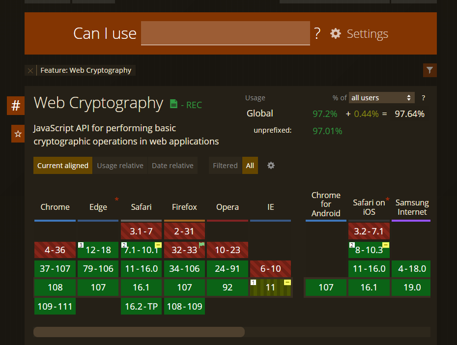
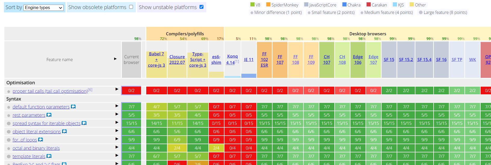
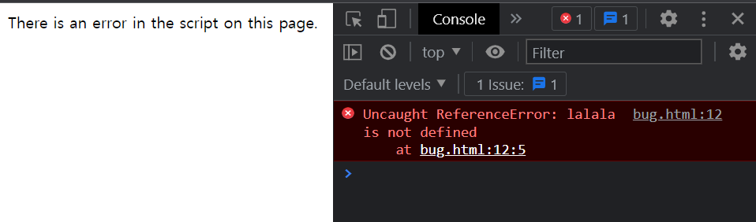

###### 기간: 11월28일 ~ 12월3일


# 1.1 자바스크립트란?

## 정의

> 웹 페이지에 생동감을 불어넣기 위해 만들어진 프로그래밍 언어
>
> ➡ 페이지를 동적으로 만들어준다.


자바스크립트는 자바와는 연관 없는, 독자적인 언어임!

➡ 당시 유행하던 자바를 따라 이름지었기 때문에 많은 사람들이 혼동하지만, 이름만 비슷한 것


자바스크립트는 브라우저와 서버, 자바스크립트 엔진이 있는 모든 디바이스에서 동작한다.

브라우저마다 엔진의 종류가 다양하다.

> - V8 : Chrome, Opera
> - SpiderMonkey : Firefox
> - Trident, Chaker : IE (버전에 따라)
> - ChakraCore : Microsoft Edge
> - SquirrelFish : Safari


**❓ 엔진의 동작 원리**

> 1. 엔진(브라우저라면 내장 엔진)이 스크립트를 읽음 ➡ **파싱**
> 2. 읽어 들인 스크립트를 기계어로 전환 ➡ **컴파일**
> 3. 기계어로 전환된 코드가 실행 (기계어로 전환되었기 때문에 실행 속도가 빠름)


## 브라우저에서 할 수 있는 일

브라우저에서 자바스크립트로 할 수 있는 일

> - 페이지에 새로운 HTML을 추가하거나 기존 HTML, 혹은 스타일 수정하기
> - 마우스 클릭이나 포인터의 움직임, 키보드 키 눌림 등과 같은 사용자 행동에 반응하기
> - 네트워크를 통해 원격 서버에 요청을 보내거나, 파일 다운로드, 업로드하기([AJAX](https://en.wikipedia.org/wiki/Ajax_(programming))나 [COMET](https://en.wikipedia.org/wiki/Comet_(programming))과 같은 기술 사용)
> - 쿠키를 가져오거나 설정하기, 사용자에게 질문을 건네거나 메시지 보여주기
> - 클라이언트 측에 데이터 저장하기(로컬 스토리지)


## 브라우저에서 할 수 없는 일

브라우저는 보안상 악성 웹페이지가 개인 정보에 접근하거나 사용자의 데이터를 손상하는 것을 막기 위해 자바스크립트의 기능에 제약을 걸어놓음!


## 자바스크립트만의 강점

> - HTML/CSS와 완전히 통합할 수 있음
> - 간단한 일은 간단하게 처리할 수 있게 해줌
> - 모든 주요 브라우저에서 지원하고, 기본 언어로 사용됨

➡ 자바스크립트는 유연한 언어!


## 자바스크립트 너머의 언어들

아무리 자바스크립트라해도 모두의 요구를 충족할 순 없다. 따라서 브라우저에서 실행되기 전에 자바스크립트로 트랜스파일(transpile, 변환)할 수 있는 새로운 언어들이 있다.

> - [**CoffeeScript**](https://coffeescript.org/) : 짧은 문법을 도입하여 명료하고 이해하기 쉬운 코드를 작성할 수 있다. Ruby 개발자들이 좋아한다.
> - [**TypeScript**](http://www.typescriptlang.org/) : 개발을 단순화 하고 복잡한 시스템을 지원하려는 목적으로 '자료형의 명시화(strict data typing)'에 집중해 만든 언어이다. 자바스크립트 공부 이후 TypeScript를 공부하는 것이 아주 좋다!! (개발 : Microsoft)
> - [**Flow**](http://flow.org/) : 역시 자료형을 강제하는데, TypeScript와는 다른 방식을 사용한다. (개발 : Facebook)
> - [**Dart**](https://www.dartlang.org/) : 모바일 앱과 같이 브라우저가 아닌 환경에서 동작하는 고유의 엔진을 가진 독자적 언어이다. (개발 : Google)


## 요약

> - 자바스크립트는 브라우저에서만 쓸 목적으로 고안된 언어이지만, 지금은 다양한 환경에서 쓰이고 있다.
> - 오늘날 자바스크립트는 브라우저 환경에서 가장 널리 사용되는 언어로, HTML/CSS와 완전한 통합이 가능하다.
> - 자바스크립트로 '트랜스파일’할 수 있는 언어는 많다. 각 언어마다 고유한 기능을 제공하며, 자바스크립트에 숙달한 뒤 이 언어들을 살펴볼 것을 추천한다.


# 1.2 매뉴얼과 명세서

## 명세서

[**ECMA-262 명세서(specification)**](https://www.ecma-international.org/publications/standards/Ecma-262.htm)

> - 자바스크립트와 관련된 가장 심도 있고 상세한 정보를 담고 있는 공식 문서
> - 이 명세서에서 자바스크립트라는 언어를 정의한다.
> - 하지만 처음 접하는 사람에게는 이해하기 어려운 형식이기 때문에 아래 MDN 문서를 추천한다.


## 매뉴얼

[**MDN JavaScript Reference**](https://developer.mozilla.org/en-US/docs/Web/JavaScript/Reference)

> - Mozilla 재단이 운영하며 다양한 예제와 정보가 있다.
> - 특정 함수나 메서드에 대한 깊이 있는 정보를 얻고 싶다면 이 사이트가 최고!
> - 검색 방법 : `찾고 싶은 내용 + MDN`


## 호환성 표

자바스크립트는 끊임없이 발전하는 언어이기에 새로운 기능이 정기적으로 추가된다. 특정 브라우저나 엔진이 내가 사용하려는 기능을 지원하는지 확인할 땐, 아래 두 사이트를 참고하자.

- [http://caniuse.com](http://caniuse.com/)

  - 브라우저가 특정 기능을 지원하는지 표 형태로 확인 가능

  - ex) 암호화 관련 기능인 cryptography를 특정 브라우저에서 사용할 수 있는지 아닌지를 보려면 http://caniuse.com/#feat=cryptography를 확인하면 된다.

    

- https://kangax.github.io/compat-table

  - 자바스크립트 기능 목록이 있고, 해당 기능을 특정 엔진이 지원하는지 여부를 거대한 표를 통해 보여줌

    

메서드, 함수 관련 정보, 브라우저 지원 여부 등은 개발 시 의사결정을 내릴 때 꼭 필요한 정보이기 때문에, 특정 기능에 대한 상세한 정보가 필요할 때 위 페이지를 방문해보자.


# 1.3 코드 에디터

개발자는 코드 에디터(code editor)에서 가장 많은 시간을 보낸다. (나도 어느새 그렇게 되었다..!) 코드 에디터는 크게 통합 개발 환경(IDE)과 경량 에디터로 나뉘는데, 많은 개발자가 둘 중 하나를 택해 작업한다.


## 통합 개발 환경 (Integrated Development Environment, IDE)

강력한 에디터로 보통 '프로젝트 전체’를 관장하는 다양한 기능을 제공한다. '개발 환경’을 쾌적하게 해주는 통합 환경을 제공한다.

IDE를 이용하면 수많은 파일로 구성된 프로젝트를 불러오고, 파일 간의 탐색 작업이 수월해진다. 단순히 열려있는 파일뿐만 아니라 전체 프로젝트에 기반한 자동 완성 기능도 사용 가능하다. 또한 [git](https://git-scm.com/)과 같은 버전 관리 시스템, 테스팅 환경 등, '프로젝트 수준’의 작업도 IDE에서 할 수 있다.

> - [Visual Studio Code](https://code.visualstudio.com/) : 크로스 플랫폼, 무료
> - [WebStorm](http://www.jetbrains.com/webstorm/) : 크로스 플랫폼, 유료


**📌 참고 ' Visual Studio'**

> ' Visual Studio'는 'Visual Studio Code’와는 다르다. 'Visual Studio’는 .NET 플랫폼 개발에 쓰이는 유료 에디터로, Windows에서만 사용 가능하며 자바스크립트도 지원한다. Visual Studio의 무료 버전인 [Visual Studio Community](https://www.visualstudio.com/vs/community/)도 있으니 참고하자.


## 경량 에디터 (lightweight editor)

IDE만큼 많은 기능을 제공하진 않지만, 속도가 빠르고 단순한 것이 장점이다. 

경량 에디터는 파일을 열고 바로 수정하고자 할 때 주로 사용된다.


**📌 '경량 에디터’와 'IDE’의 가장 큰 차이점**

> IDE는 프로젝트 레벨에서 작동한다는 점
>
> IDE는 구동 시 불러와야 할 데이터가 많고, 필요하다면 구동 시 프로젝트 구조를 분석하는 일 등도 한다. 파일 하나만 수정하고 싶다면 경량 에디터를 사용하는 것이 훨씬 빠르다.
>
> 경량 에디터는 다양한 플러그인을 지원한. 디렉터리 레벨 문법 분석기나 자동완성기능 등을 플러그인을 설치해 사용할 수 있다. 플러그인을 사용하면 경량 에디터에서도 IDE 못지않게 다양한 기능을 사용할 수 있기 때문에 점차 경량 에디터와 IDE 사이의 엄격한 구분이 사라져가는 추세이다.


📌 추천 에디터

> - [Atom](https://atom.io/) : 크로스 플랫폼, 무료 (사용경험 O)
> - [Visual Studio Code](https://code.visualstudio.com/) : 크로스 플랫폼, 무료 (현재 사용중)
> - [Sublime Text](http://www.sublimetext.com/) : 크로스 플랫폼, 셰어웨어 (사용경험 O)
> - [Notepad++](https://notepad-plus-plus.org/) : Windows, 무료
> - [Vim](http://www.vim.org/)이나 [Emacs](https://www.gnu.org/software/emacs/) : 에디터로 사용법만 잘 숙지하면 충분히 에디터 역할을 할 수 있다.


# 1.4 개발자 콘솔

브라우저는 스크립트에 에러가 발생해도 사용자에게 직접 보여주지 않는다. 이 때 브라우저에 내장된 '개발자 도구'를 통해 에러를 확인할 수 있으며 스크립트에 대한 정보도 얻을 수 있다.

Chorme과 Firefox에서 제공하는 개발자 도구가 가장 좋다.


## Chrome

윈도우에서는 `F12`, Mac에서는 `Cmd+Opt+J`를 누르면 개발자 도구가 열린다.




# 2.1 Hello, world!

## 'script' 태그

`<script>` 태그를 이용해 자바스크립트 프로그램을 HTML 문서 대부분의 위치에 삽입할 수 있다.

예시 : 

```html
<!DOCTYPE HTML>
<html>
<body>
  <p>스크립트 전</p>
  <script>
    alert( 'Hello, world!' );
  </script>
  <p>스크립트 후</p>
</body>
</html>
```


## 모던 마크업

`<script>` 태그에는 요즘 잘 사용하진 않지만, 오래된 코드에서 종종 발견되는 몇 가지 속성(attribute)이 있다.

- `type` 속성 :  `<script type=…>`

  HTML4에서 스크립트에 `type`을 명시하는 것이 필수였다. 그래서 `type="text/javascript"` 속성이 붙은 스크립트를 어렵지 않게 찾을 수 있었던 것! 현재는 타입 명시가 필수가 아니며, 모던 HTML 표준에서는 이 속성의 의미가 바뀌었다. 이제 이 속성은 자바스크립트 모듈에 사용할 수 있다.

- `language` 속성: `<script language=…>`

  현재 사용하고 있는 스크립트 언어를 나타낸다. 지금은 자바스크립트가 기본 언어이므로 속성의 의미가 퇴색되어 더는 사용할 필요가 없다.

- 스크립트 전후에 위치한 주석

  아주 오래된 책과 가이드에서는 다음과 같이 `<script>` 태그 안에 주석이 존재하는 걸 볼 수 있다.

  ```html
  <script type="text/javascript"><!--
      ...
  //--></script>
  ```

  태그 옆에 붙은 주석은 `<script>` 태그를 처리하지 못하는 브라우저가 해당 스크립트를 읽지 못하게 하려고 사용했는데, 지난 15년간 출시된 브라우저는 `<script>` 태그를 처리할 수 있으므로, 이런 형태의 주석이 있다면 아주 오래된 코드라는 뜻이다.


## 외부 스크립트

자바스크립트 코드의 양이 많은 경우, 파일로 소분하여 저장하고 `src` 속성을 사용해 HTML에 삽입한다.

```html
<script src="/path/to/script.js"></script>
```

위의 `/path/to/script.js`와 같이 사이트의 루트에서부터 파일이 위치한 절대 경로를 사용할수도, 현재 페이지에서의 상대 경로를 사용할 수도 있다 (같은 폴더 내에 있는 파일인 `"script.js"`를 `src="script.js"`로 참조하는 것처럼). 또, URL 전체를 속성으로 사용할 수도 있다.

```html
<script src="https://cdnjs.cloudflare.com/ajax/libs/lodash.js/4.17.11/lodash.js"></script>
```


복수의 스크립트를 HTML에 삽입하고 싶은 경우, 스크립트 태그를 여러 개 사용하면 된다.

```html
<script src="/js/script1.js"></script>
<script src="/js/script2.js"></script>
…
```


**📌 주의**

> HTML 안에 직접 스크립트를 작성하는 방식은 대개 스크립트가 아주 간단할 때만 사용한다. 스크립트가 길어지면 별개의 분리된 파일로 만들어 저장하는 것이 좋다.
>
> 스크립트를 별도의 파일에 작성하면 브라우저가 스크립트를 다운받아 [캐시(cache)](https://en.wikipedia.org/wiki/Web_cache)에 저장하기 때문에, 성능상의 이점이 있다.
>
> 여러 페이지에서 동일한 스크립트를 사용하는 경우, 브라우저는 페이지가 바뀔 때마다 스크립트를 새로 다운받지 않고 캐시로부터 스크립트를 가져와 사용한다.
>
> ➡ 이를 통해 트래픽이 절약되고 웹 페이지의 실제 속도가 빨라진다.


**📌 주의 : `src` 속성이 있으면 태그 내부의 코드는 무시된다.**

> `<script>` 태그는 src 속성과 내부코드를 동시에 가지지 못하기 때문에 다음 코드는 실행되지 않는다.
>
> ```html
> <script src="file.js">
>   alert(1); // src 속성이 사용되었으므로 이 코드는 무시된다.
> </script>
> ```
>
> 따라서 `<script src="…">`로 외부 파일을 연결할지, 아니면 `<script>` 태그 내에 코드를 작성할지 선택해야 한다. 또는 스크립트를 두 개로 분리하면 정상적으로 실행된다.
>
> ```html
> <script src="file.js"></script>
> <script>
>   alert(1);
> </script>
> ```


## 요약

> - 웹 페이지에 자바스크립트 코드를 추가하기 위해 `<script>` 태그를 사용한다.
> - `type` 과 `language` 속성은 필수가 아니다.
> - 외부 스크립트 파일은 `<script src="path/to/script.js"></script>`와 같이 삽입한다.


# 2.2 코드 구조

## 문 (statement)

>  어떤 작업을 수행하는 문법 구조(syntax structure)와 명령어(command)

코드엔 원하는 만큼 문을 작성할 수 있으며 서로 다른 문은 세미콜론으로 구분한다.

```javascript
alert('Hello');
alert('World');
```

코드의 가독성을 높이기 위해 각 문은 서로 다른 줄에 작성하는 것이 일반적이다.


## 세미콜론

줄 바꿈이 있으면 세미콜론(semicolon)을 생략할 수 있다.

```javascript
alert('Hello')
alert('World')
```

- [세미콜론 자동 삽입(automatic semicolon insertion)](https://tc39.github.io/ecma262/#sec-automatic-semicolon-insertion)

  자바스크립트는 줄 바꿈이 있으면 이를 ‘암시적’ 세미콜론으로 해석한다. 

대부분의 경우 줄 바꿈은 세미콜론을 의미하지만, '항상’ 그런 것은 아니다!

예외 : 

```javascript
alert(3 +
1
+ 2);
```


세미콜론이 정말로 필요하지만 자바스크립트가 이를 추정하지 ‘못하는’ 상황도 존재하는데 이런 상황에서 발생하는 에러는 찾거나 고치기가 상당히 어렵다.

따라서 세미콜론은 생략 가능하지만, 세미콜론을 사용하는 것이 더 안전하므로 그냥 항상 사용하자!


## 주석

무슨 일이 왜 벌어지고 있는지를 설명해준다.

주석은 스크립트의 어느 곳에나 작성할 수 있다. 자바스크립트 엔진은 주석을 무시하기 때문에 주석의 위치는 실행에 영향을 주지 않는다.

한 줄짜리 주석은 두 개의 슬래시 `//`로 시작됩니다.

```javascript
// 이 주석은 한 줄을 다 차지한다.
alert('Hello');

alert('World'); // 이 주석은 문 다음 이어진다.
```

여러 줄의 주석은 슬래시와 별표 `/*`로 시작해 별표와 슬래시 `*/`로 끝난다.

````javascript
/* 두 줄짜리 주석 예제
이것은 여러 줄의 주석이다.
*/
alert('Hello');
alert('World');
````

주석 안의 내용은 무시된다. 주석으로 코드 일부를 일시적으로 비활성화할 수 있습니다.


**📌 주석처리를 위한 단축키**

> 대부분의 에디터는 주석 처리 단축키를 지원하는데, 블록을 지정하고 단축키를 누르면 원하는 코드를 주석 처리할 수 있다.
>
> `Ctrl+/` : 한 줄 주석 처리
>
> `Ctrl+Shift+/` : 여러 줄의 주석 처리

