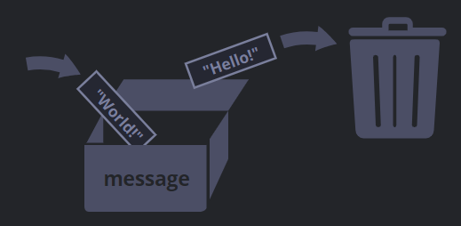

###### 기간 : 12월 12일 ~ 12월 17일

# 2.3 엄격모드

ECMAScript5(ES5)에서 새로운 기능이 추가되고 기존 기능 중 일부가 변경되었다. 기존 기능을 변경하였기 때문에 하위 호환성 문제가 생길 수 있어 변경사항 대부분은 ES5의 기본 모드에선 활성화되지 않도록 설계되었다. 대신 `use strict`라는 특별한 지시자를 사용해 엄격 모드(strict mode)를 활성화 했을 때만 이 변경사항이 활성화되게 하였다.


## use strict

지시자 `"use strict"` 또는 `'use strict'`가 스트립트 최상단에 오면 스크립트 전체가 모던한 방식으로 동작한다.

```javascript
"use strict";

// 이 코드는 모던한 방식으로 실행된다.
...
```

 `"use strict"`가 스크립트 최상단이 아닌 함수 본문 맨 앞에 오면 오직 해당 함수만 엄격 모드로 실행된다.


**📌 `"use strict"`의 위치**

`"use strict"`는 스크립트 최상단에 있어야 한다. 그렇지 않으면 엄격 모드가 활성화 되지 않는다.

```javascript
alert("some code");
// 하단에 위치한 "use strict"는 스크립트 상단에 위치하지 않으므로 무시된다.

"use strict";

// 엄격 모드가 활성화되지 않는다.
```


📌 `use strict`**를 취소할 방법은 없다.**

자바스크립트 엔진을 이전 방식으로 되돌리는 `"no use strict"`같은 지시자는 존재하지 않는다.


## 브라우저 콘솔

개발한 기능을 테스트하기 위해 [브라우저 콘솔](https://ko.javascript.info/devtools)을 사용하는 경우, 기본적으로 `use strict`가 적용되어있지 않다는 점에 주의하자!

대신 `'use strict’`를 입력한 후, `Shift+Enter키`를 눌러 줄 바꿈 해 원하는 스크립트를 입력하면 콘솔에서도 사용할 수 있다.

```javascript
'use strict'; <Shift+Enter를 눌러 줄 바꿈 함>
//  ...테스트하려는 코드 입력
<Enter를 눌러 실행>
```


## 'use strict'를 꼭 사용해야 할까

코드를 **클래스**와 **모듈**을 사용해 구성한다면 `"use strict"`가 자동으로 적용되기 때문에 이를 생략해도 된다. 


# 2.4 변수와 상수

## 변수

> 데이터를 저장할 때 쓰이는 '이름이 붙은 저장소'

자바스크립트에선 `let` 키워드를 사용해 변수를 생성한다.

```javascript
let message; // 'message’라는 이름을 가진 변수를 생성(선언)

message = 'Hello' // 문자열을 저장

alert(message); // 변수에 저장된 값을 보여줌
```

```javascript
let message = 'Hello!'; // 한 줄에 변수를 정의하고 값을 할당함

alert(message); // Hello!
```

한 줄에 여러 변수를 선언하는 것도 가능

```javascript
let user = 'John', age = 25, message = 'Hello';
```

하지만 가독성을 위해 한 줄에는 하나의 변수를 작성하자.

```javascript
let user = 'John';
let age = 25;
let message = 'Hello';
```

```javascript
// 여러 방식으로 변수 정의하기
let user = 'John',
  age = 25,
  message = 'Hello';

// 쉼표가 먼저 오는 방식
let user = 'John'
  , age = 25
  , message = 'Hello';
```

개인의 취향과 미적 감각에 따라 원하는 방식으로 코드를 작성하면 된다.


📌 **`let` 대신 `var`**

`var`는 `let`과 *거의* 동일하게 변수를 선언하는 데 쓰인다. 다만 `var`는 오래된 방식이다.

```javascript
var message = 'Hello';
```


## 현실 속의 비유

‘상자’ 안에 데이터를 저장하는데, 이 상자에는 특별한 이름표가 붙어 있다고 상상해보자. 이렇게 하면 '변수’를 좀 더 쉽게 이해할 수 있다.

예를 들어, 변수 `message`는 `message`라는 이름표가 붙어있는 상자에 `"Hello!"`라는 값을 저장한 것이라고 생각할 수 있다.


변수에는 어떤 값이든지 넣을 수 있고, 원하는 만큼 값을 변경할 수도 있다.

```javascript
let message;
message = 'Hello!';
message = 'World!'; // 값이 변경되었습니다.
alert(message);
```



변수 두 개를 선언하고, 한 변수의 데이터를 다른 변수에 복사할 수도 있다.

```javascript
let Hello = 'Hello world!';

let message;

// Hello의 'Hello world' 값을 message에 복사한다.
message = Hello;

// 이제 두 변수는 같은 데이터를 가진다.
alert(Hello); // Hello world!
alert(message); // Hello world!
```


📌 **변수를 두 번 선언하면 에러가 발생한다.**

변수는 한 번만 선언해야 한다. 같은 변수를 여러 번 선언하면 에러가 발생한다.

```javascript
let message = "This";

// 'let'을 반복하면 에러가 발생합니다.
let message = "That"; // SyntaxError: 'message' has already been declared
```

따라서 변수는 딱 한 번만 선언하고, 선언한 변수를 참조할 때는 `let` 없이 변수명만 사용해 참조해야 한다.


📌 **함수형 언어**

> [함수형(functional)](https://en.wikipedia.org/wiki/Functional_programming) 프로그래밍 언어는 변숫값 변경을 금지한다. [스칼라(Scala)](http://www.scala-lang.org/)와 [얼랭(Erlang)](http://www.erlang.org/)은 대표적인 함수형 언어이다.
>
> 이들 언어에서는 ‘상자 속에’ 값이 일단 저장되면, 그 값을 영원히 유지한다. 다른 값을 저장하고 싶다면 새로운 상자를 만들어야(새 변수를 선언해야)만 하며, 이전 변수를 재사용할 수 없다.
>
> 함수형 언어는 중대한 개발에 상당히 적합한 언어입니다. 이런 제약이 장점으로 작용하는 병렬 계산(parallel computation)과 같은 영역도 있다. 당장은 사용할 계획이 없더라도 이런 언어를 공부하는 것은 시야를 넓히는 데 도움이 된다.


## 변수 명명 규칙

자바스크립트에선 변수 명명 시 두 가지 제약 사항이 있다.

> 1. 변수명에는 오직 문자와 숫자, 그리고 기호 `$`와 `_`만 들어갈 수 있다.
> 2. 첫 글자는 숫자가 될 수 없다.

```javascript
// 유효한 변수명의 예시
let userName;
let test123;

let $ = 1; // '$'라는 이름의 변수를 선언
let _ = 2; // '_'라는 이름의 변수를 선언

alert($ + _); // 3
```

```javascript
// 잘못된 변수명의 예시
let 1a; // 변수명은 숫자로 시작해선 안 됨
let my-name; // 하이픈 '-'은 변수명에 올 수 없음
```


- **[카멜 표기법(camelCase)](https://en.wikipedia.org/wiki/CamelCase)**

  : 단어를 차례대로 나열하면서 첫 단어를 제외한 각 단어의 첫 글자를 대문자로 작성한다.

  여러 단어를 조합하여 변수명을 만들 때 흔히 사용된다.

   ex) `myVeryLongName`

- **대·소문자 구별**

  `apple`와 `AppLE`은 서로 다른 변수이다.

- **비 라틴계 언어도 변수명에 사용할 수 있지만 권장하지 않음**

  키릴 문자, 심지어 상형문자 등 모든 언어를 변수명에 사용할 수 있다.

  ```javascript
  let имя = '...';
  let 我 = '...';
  ```

  위 코드에는 기술적인 에러가 없고 변수명도 유효하다. 하지만 영어를 변수명에 사용하는 것이 국제적인 관습이므로, 변수명은 영어를 사용해서 만드는 것이 좋다. 다른 나라 사람이 스크립트를 볼 경우 등을 대비해 장기적인 안목을 가지고 코드를 작성하자.

- **예약어**

  [예약어(reserved name) 목록](https://developer.mozilla.org/en-US/docs/Web/JavaScript/Reference/Lexical_grammar#Keywords)에 있는 단어는 자바스크립트 내부에서 이미 사용 중이기 때문에 변수명으로 사용할 수 없다.

  예약어 예시: `let`, `class`, `return`, `function`

  아래 코드는 문법 에러를 발생시킨다.

  ```javascript
  let let = 5; // 'let'을 변수명으로 사용할 수 없으므로 에러!
  let return = 5; // 'return'을 변수명으로 사용할 수 없으므로 에러!
  ```

- **`use strict` 없이 할당하기**

  변수는 대개 정의되어 있어야 사용할 수 있습니다. 그러나 예전에는 `let` 없이도 단순하게 값을 할당해 변수를 생성하는 것이 가능했다. `use strict`를 쓰지 않으면 과거 스크립트와의 호환성을 유지할 수 있기 때문에 여전히 이 방식을 사용할 수 있다.

  ```javascript
  // 참고: 이 예제에는 "use strict"가 없다.
  
  num = 5; // 변수 'num'이 정의되어있지 않더라도, 단순 할당만으로 변수가 생성됩니다.
  
  alert(num); // 5
  ```

  이렇게 변수를 생성하는 것은 엄격 모드에서 에러를 발생시키기 때문에 나쁜 관습이다.

  ```javascript
  "use strict";
  
  num = 5; // error: num is not defined
  ```


## 상수

변화하지 않는 변수를 선언할 때는 `let` 대신 `const`를 사용한다.

```javascript
const myBirthday = '18.06.1998';
```

이렇게 `const`로 선언한 변수를 '상수(constant)'라고 부른다. 상수는 재할당할 수 없으므로 상수를 변경하려고 하면 에러가 발생한다.

```javascript
const myBirthday = '18.06.1998';

myBirthday = '01.01.2001'; // error, can't reassign the constant!
```

변숫값이 절대 변경되지 않을 것이라 확신하면, 값이 변경되는 것을 방지하면서 다른 개발자들에게 이 변수는 상수라는 것을 알리기 위해 `const`를 사용해 변수를 선언하도록 한다.


## 대문자 상수

기억하기 힘든 값을 변수에 할당해 별칭으로 사용하는 것은 널리 사용되는 관습이다. 이런 상수는 대문자와 밑줄로 구성된 이름으로 명명한다. 예시로 웹에서 사용하는 색상 표기법인 16진수 컬러 코드에 대한 상수를 한번 만들어보자.

```javascript
const COLOR_RED = "#F00";
const COLOR_GREEN = "#0F0";
const COLOR_BLUE = "#00F";
const COLOR_ORANGE = "#FF7F00";

// 색상을 고르고 싶을 때 별칭을 사용할 수 있게 되었다.
let color = COLOR_ORANGE;
alert(color); // #FF7F00
```

대문자로 상수를 만들어 사용하면 다음과 같은 장점이 있다.

- `COLOR_ORANGE`는 `"#FF7F00"`보다 기억하기가 훨씬 쉽다.
- `COLOR_ORANGE`를 사용하면 `"#FF7F00"`를 사용하는 것보다 오타를 낼 확률이 낮다.
- `COLOR_ORANGE`가 `#FF7F00`보다 훨씬 유의미하므로, 코드 가독성이 증가한다.

그렇다면 언제 일반적인 방식으로 상수를 명명하고, 언제 대문자를 사용해서 명명해야 하는 걸까?

'상수’는 변수의 값이 절대 변하지 않음을 의미한다. 그중에는 (빨간색을 나타내는 16진수 값처럼) 코드가 실행되기 전에 이미 그 값을 알고 있는 상수도 있고, 런타임 과정에서 *계산되지만* 최초 할당 이후 값이 변하지 않는 상수도 있다.

예시:

```javascript
const pageLoadTime = /* 웹페이지를 로드하는데 걸린 시간 */;
```

`pageLoadTime`의 값은 페이지가 로드되기 전에는 정해지지 않기 때문에 일반적인 방식으로 변수명을 지었다. 하지만 이 값은 최초 할당 이후에 변경되지 않으므로 여전히 상수이다.

> 정리하자면, 대문자 상수는 ‘하드 코딩한’ 값의 별칭을 만들 때 사용하면 됩니다.


## 바람직한 변수명

> 변수명은 간결하고, 명확해야 한다.
>
> 변수가 담고있는 것이 무엇인지 잘 설명할 수 있어야 한다.

변수의 이름을 짓는 것은 프로그래밍에서 가장 중요하고 복잡한 기술 중 하나이다. 변수명만 봐도 초보자가 코드를 작성했는지, 노련한 개발자가 작성했는지 알 수 있다.

실제 프로젝트에선 맨 처음부터 완전히 독립적인 코드를 작성하기보다 기존 코드의 틀을 변경하고 확장하는데 대부분의 시간을 보낸다. 작성했던 코드를 얼마 후에 다시 봤을 때, 정보에 알맞은 이름이 적혀있으면(변수가 올바른 이름을 가졌을 때) 정보를 더 쉽게 찾을 수 있다.

그러므로 변수를 선언하기 전에 내가 지은 변수의 이름이 괜찮은지 숙고해 보아야 한다!

📌 **변수 명명 시 참고하기 좋은 규칙**

- `userName` 이나 `shoppingCart`처럼 사람이 읽을 수 있는 이름 사용하기
- 무엇을 하고 있는지 명확히 알고 있지 않을 경우 외에는 줄임말이나 `a`, `b`, `c`와 같은 짧은 이름은 피하기
- 최대한 서술적이고 간결하게 명명하기
  - `data`와 `value`는 나쁜 이름의 예시이다. 이런 이름은 아무것도 설명해주지 않는다. 코드 문맥상 변수가 가리키는 데이터나 값이 아주 명확할 때에만 이런 이름을 사용하자.
- 자신만의 규칙이나 소속된 팀의 규칙을 따르자.
  - 만약 사이트 방문객을 'user’라고 부르기로 했다면, 이와 관련된 변수를 `currentVisitor`나 `newManInTown`이 아닌 `currentUser`나 `newUser`라는 이름으로 지어야 한다.


📌 **재사용 아니면 새로 만들기?**

재사용된 변수는 과거에 붙여진 스티커를 떼지 않은 채 물건만 바뀐 상자와 같다. 상자 안에는 무엇이 들어 있을까? 내용물에 대한 정보를 알고 있는 사람은 누구일까? 이를 알기 위해선 상자에 가까이 다가가 확인해야만 한다.

변수를 재사용하면 변수 선언에 쏟는 노력을 좀 덜 순 있겠지만, 디버깅에 열 배 더 많은 시간을 쏟아야 한다.

> 변수를 추가하는 것은 악습이 아닌, 좋은 습관이다.

모던 자바스크립트 압축기(minifier)와 브라우저는 코드 최적화를 잘해준다. 변수를 추가한다고 해서 성능 이슈가 생기지 않는다. 값이 다른 경우, 변수를 다르게 선언해 주면 코드 최적화에 도움이 될 수도 있다.


## 요약

> `var`, `let`, `const`를 사용해 변수를 선언할 수 있으며, 선언된 변수에 데이터를 저장할 수 있다.
>
> - `let` : 모던한 변수 선언 키워드
> - `var` : 오래된 변수 선언 키워드이며 잘 사용하지 않는다. `let`과의 미묘한 차이점이 있다.
> - `const` : `let`과 비슷하지만, 변수의 값을 변경할 수 없다.
>
> 변수명은 변수가 담고 있는 것이 무엇인지 쉽게 알 수 있도록 지어져야 한다.


# 2.5 자료형

> 자바스크립트에서 값은 항상 문자열이나 숫자형 같은 특정한 자료형에 속한다.
>
> 자바스크립트에는 여덟 가지 기본 자료형이 있다.
>
> 자바스크립트의 변수는 자료형에 관계없이 모든 데이터일 수 있다. 따라서 변수는 어떤 순간에 문자열일 수 있고 다른 순간엔 숫자가 될 수도 있다.

```javascript
// no error
let message = "hello";
message = 123456;
```

이처럼 자료의 타입은 있지만 변수에 저장되는 값의 타입은 언제든지 바꿀 수 있는 언어를 ‘**동적 타입(dynamically typed)**’ 언어라고 부른다.


## 숫자형 (number type)

정수 및 부동소수점 숫자(floating point number)를 나타낸다.

```javascript
let n = 123;
n = 12.345;
```

숫자형과 관련된 연산은 다양한데, 곱셈 `*`, 나눗셈 `/`, 덧셈 `+`, 뺄셈 `-` 등이 대표적이다.

숫자형엔 일반적인 숫자 외에 `Infinity`, `-Infinity`, `NaN`같은 '특수 숫자 값(special numeric value)'이 포함된다.

- `Infinity`

  : 어떤 숫자보다 더 큰 특수 값, [무한대(∞)](https://en.wikipedia.org/wiki/Infinity)를 나타냄

  어느 숫자든 0으로 나누면 무한대를 얻을 수 있음

  ```javascript
  alert( 1 / 0 ); // 무한대
  ```

  `Infinity`를 직접 참조할 수도 있음

  ```javascript
  alert( Infinity ); // 무한대
  ```

- `NaN`

  : 계산 중에 에러가 발생했다는 것을 나타내주는 값

  부정확하거나 정의되지 않은 수학 연산을 사용하면 계산 중에 에러가 발생하는데, 이때 `NaN`이 반환됨

  ```javascript
  alert( "숫자가 아님" / 2 ); // NaN, 문자열을 숫자로 나누면 오류가 발생
  ```

  `NaN`은 여간해선 바뀌지 않는다. `NaN`에 어떤 추가 연산을 해도 결국 `NaN`이 반환된다.

  ```javascript
  alert( "숫자가 아님" / 2 + 5 ); // NaN
  ```

  연산 과정 어디에선가 `NaN`이 반환되었다면, 이는 모든 결과에 영향을 미친다.


📌 **수학 연산은 안전하다.**

> 자바스크립트에서 행해지는 수학 연산은 '안전’하다고 볼 수 있다. 0으로 나눈다거나 숫자가 아닌 문자열을 숫자로 취급하는 등의 이례적인 연산이 자바스크립트에선 가능합니다.
>
> 말이 안 되는 수학 연산을 하더라도 스크립트는 치명적인 에러를 내뿜으며 죽지 않으며, `NaN`을 반환하며 연산이 종료될 뿐이다.

현실에서는 특수 숫자 값을 숫자로 취급하지 않지만, 자바스크립트에서는 특수 숫자 값을 숫자형으로 분류한다.


## BigInt

내부 표현 방식 때문에 자바스크립트에서는 (2<sup>53</sup>-1)(9007199254740991) 보다 큰 값 혹은 -(2<sup>53</sup>-1) 보다 작은 정수는 '숫자형’을 사용해 나타낼 수 없다.

사실 대부분의 상황에서 이런 제약사항은 문제가 되지 않는다. 하지만 암호 관련 작업같이 아주 큰 숫자가 필요한 상황이거나 아주 높은 정밀도로 작업을 해야 할 때는 이런 큰 숫자가 필요하다.

`BigInt`형은 표준으로 채택된 지 얼마 안 된 자료형으로, 길이에 상관없이 정수를 나타낼 수 있다.

`BigInt`형 값은 정수 리터럴 끝에 `n`을 붙이면 만들 수 있다.

```javascript
// 끝에 'n'이 붙으면 BigInt형 자료입니다.
const bigInt = 1234567890123456789012345678901234567890n;
```

`BigInt`형 숫자는 자주 쓰이지는 않는다.


## 문자형

자바스크립트에서는 문자열(string)을 따옴표로 묶는다.

```javascript
let str = "Hello";
let str2 = 'Single quotes are ok too';
let phrase = `can embed another ${str}`;
```

따옴표는 세 종류가 있다.

> 1. 큰따옴표: `"Hello"`
> 2. 작은따옴표: `'Hello'`
> 3. 역 따옴표(백틱, backtick): ``Hello``

큰따옴표와 작은따옴표는 ‘기본적인’ 따옴표로, 자바스크립트에서는 이 둘의 차이가 없다.

역 따옴표는 변수나 표현식을 감싼 후 `${…}`를 안에 넣어주면, 아래와 같이 원하는 변수나 표현식을 문자열 중간에 손쉽게 넣을 수 있다.

```javascript
let name = "John";

// 변수를 문자열 중간에 삽입
alert( `Hello, ${name}!` ); // Hello, John!

// 표현식을 문자열 중간에 삽입
alert( `the result is ${1 + 2}` ); // the result is 3
```

`${…}` 안에는 `name` 같은 변수나 `1 + 2` 같은 수학 관련 표현식을 넣을 수 있다. 더 복잡한 표현식 외에도 무엇이든 들어갈 수 있다. 이렇게 문자열 중간에 들어간 변수나 표현식은 평가가 끝난 후 문자열의 일부가 된다.

큰따옴표나 작은따옴표를 사용하면 중간에 표현식을 넣을 수 없다는 점에 주의하자. 이 방법은 역 따옴표를 써야만 가능하다.

```javascript
alert( "the result is ${1 + 2}" ); // the result is ${1 + 2} (큰따옴표는 확장 기능을 지원하지 않음)
```


📌 **글자형은 없다.**

> 일부 언어는 글자 하나를 저장할 때 쓰이는 자료형, '글자(character)'형을 따로 지원한다. (C 언어와 Java의 `char`가 대표적인 예)
>
> 자바스크립트는 글자형을 지원하지 않으며 `문자형`만 있다. 여기에는 글자가 하나 혹은 여러 개 들어갈 수 있다.


## 불린형

불린형(논리 타입)은 `true`와 `false` 두 가지 값밖에 없는 자료형이다.

불린형은 긍정(yes)이나 부정(no)을 나타내는 값을 저장할 때 사용한다. `true`는 긍정, `false`는 부정을 의미한다.

예시 :

```javascript
let nameFieldChecked = true; // 네, name field가 확인되었습니다(checked).
let ageFieldChecked = false; // 아니요, age field를 확인하지 않았습니다(not checked).
```

불린값은 비교 결과를 저장할 때도 사용된다.

```javascript
let isGreater = 4 > 1;

alert( isGreater ); // true (비교 결과: "yes")
```


## 'null' 값

`null` 값은 지금까지 소개한 자료형 중 어느 자료형에도 속하지 않는 값이다.

`null` 값은 오로지 `null` 값만 포함하는 별도의 자료형을 만든다.

```javascript
let age = null;
```

자바스크립트의 `null`은 자바스크립트 이외 언어의 `null`과 성격이 다르다.

다른 언어에서는 `null`을 '존재하지 않는 객체에 대한 참조’나 '널 포인터(null pointer)'를 나타낼 때 사용한다. 하지만 자바스크립트에서는 `null`을 ‘존재하지 않는(nothing)’ 값, ‘비어 있는(empty)’ 값, ‘알 수 없는(unknown)’ 값을 나타내는 데 사용한다.

`let age = null;`은 `나이(age)`를 알 수 없거나 그 값이 비어있음을 보여준다.


## 'undefined' 값

`undefined` 값도 `null` 값처럼 자신만의 자료형을 형성하며 '값이 할당되지 않은 상태’를 나타낼 때 사용한다.

변수는 선언했지만, 값을 할당하지 않았다면 해당 변수에 `undefined`가 자동으로 할당된다.

```javascript
let age;

alert(age); // 'undefined'가 출력됩니다.
```

개발자가 변수에 `undefined`를 명시적으로 할당하는 것도 가능하다.

```javascript
let age = 100;

// 값을 undefined로 바꿉니다.
age = undefined;

alert(age); // "undefined"
```

하지만 이렇게 `undefined`를 직접 할당하는 걸 권장하지는 않는다. 대신 변수가 ‘비어있거나’ ‘알 수 없는’ 상태라는 걸 나타내려면 `null`을 사용하자. `undefined`는 값이 할당되지 않은 변수의 초기값을 위해 예약어로 남겨두자.


## 객체와 심볼

- `객체(object)`형은 특수한 자료형이다.

  객체형을 제외한 다른 자료형은 문자열이든 숫자든 한 가지만 표현할 수 있기 때문에 원시(primitive) 자료형이라 부른다. 반면 객체는 데이터 컬렉션이나 복잡한 개체(entity)를 표현할 수 있다.

  이런 특징 때문에 자바스크립트에서 객체는 좀 더 특별한 취급을 받는다.

- `심볼(symbol)`형은 객체의 고유한 식별자(unique identifier)를 만들 때 사용된다.


## typeof 연산자

`typeof` 연산자는 인수의 자료형을 반환한다. 자료형에 따라 처리 방식을 다르게 하고 싶거나 변수의 자료형을 빠르게 알아내고자 할 때 유용하다.

`typeof` 연산자는 두 가지 형태의 문법을 지원한다.

1. 연산자: `typeof x`
2. 함수: `typeof(x)`

괄호가 있든 없든 결과가 동일하다.

`typeof x`를 호출하면 인수의 자료형을 나타내는 문자열을 반환한다.

```javascript
typeof undefined // "undefined"

typeof 0 // "number"

typeof 10n // "bigint"

typeof true // "boolean"

typeof "foo" // "string"

typeof Symbol("id") // "symbol"

typeof Math // "object"  (1)

typeof null // "object"  (2)

typeof alert // "function"  (3)
```

> 마지막 세 줄에 대한 설명
>
> 1. `Math`는 수학 연산을 제공하는 내장 객체이므로 `"object"`가 출력된다.
> 2. `typeof null`의 결과는 `"object"`이다. `null`은 별도의 고유한 자료형을 가지는 특수 값으로 객체가 아니지만, 하위 호환성을 유지하기 위해 이런 오류를 수정하지 않고 남겨둔 상황이다. 언어 자체의 오류이므로 `null`이 객체가 아님에 유의하자.
> 3. `typeof`는 피연산자가 함수면 `"function"`을 반환한다. 그러므로 `typeof alert`는 `"function"`을 출력해준다. 그런데 '함수’형은 따로 없으며 함수는 객체형에 속한다. 이런 동작 방식이 형식적으로 잘못되기는 했지만, 아주 오래전에 만들어진 규칙이었기 때문에 하위 호환성 유지를 위해 남겨진 상태이다. 한편, 실무에서는 이런 특징이 매우 유용하게 사용되기도 한다.


## 요약

자바스크립트에는 여덟 가지 기본 자료형이 있다.

> - **숫자형**
>
>   : 정수, 부동 소수점 숫자 등의 숫자를 나타낼 때 사용한다. 정수의 한계는 ±253 이다.
>
> - **bigint**
>
>   : 길이 제약 없이 정수를 나타낼 수 있다.
>
> - **문자형**
>
>   : 빈 문자열이나 글자들로 이뤄진 문자열을 나타낼 때 사용한다. 단일 문자를 나타내는 별도의 자료형은 없다.
>
> - **불린형**
>
>   : `true`, `false`를 나타낼 때 사용한다.
>
> - **null**
>
>   :  `null` 값만을 위한 독립 자료형이다. `null`은 알 수 없는 값을 나타낸다.
>
> - **undefined**
>
>   : `undefined` 값만을 위한 독립 자료형이다. `undefined`는 할당되지 않은 값을 나타낸다.
>
> - **객체형**
>
>   : 복잡한 데이터 구조를 표현할 때 사용한다.
>
> - **심볼형**
>
>   : 객체의 고유 식별자를 만들 때 사용한다.


`typeof` 연산자는 피연산자의 자료형을 알려준다.

> - `typeof x` 또는 `typeof(x)` 형태로 사용한다.
> - 피연산자의 자료형을 문자열 형태로 반환한다.
> - `null`의 typeof 연산은 `"object"`인데, 이는 언어상 오류이며 null은 객체가 아니다.

