# JavaScript
<!-- 2.1 -->
- HTML 문서 대부분의 위치에 들어갈 수 있다.
- body 내부 아랫단에 <script></script> 태그를 사용하여 삽입한다.
- script 태그 내부 몇가지 속성들이 존재
  - type : 들어갈 타입을 선택해주는 명령어 (요즘은 사용하지 않음)
  - language : 스크립트 언어를 나타내는데 JS가 기본 언어이므로 사용 하지 않는다.
  - src : 외부 스크립트를 불러오는 속성 (ex => <script src="./test.js"></script>) 여러개의 스크립트 추가 가능함.
- HTML 내부에 스크립트를 생성하는 경우 페이지를 로딩할때마다 스크립트를 로딩해 줘야하기 때문에 스크립트 로딩에 많은 트래픽 등이 소요되서 효율이 좋지 못하다.
- 외부 스크립트로 JS를 저장한 후 사용하는 경우 캐시(cache)에서 페이지가 로드시 값만 불러오기 때문에 성능 향상에 좋다.
- 아래 코드와 같이 외부 스크립트와 같이 쓸수는없다.

```javascript
<script srt="file.js">alert(1);</script>
```

# 코드 구조
<!-- 2.2 -->
```javascript
alert("hello"); alert("World"); /* 이런 식으로 사용이 가능하다. */
alert("hello");
alert("World");
```
- 세미콜론이 있으면 줄바꿈을 생략이 가능하다.
- 기본적으로 코드 구조는 다양한 방식이 존재하지만 가독성이 좋게 작성하는 것이 좋다.
- 세미콜론이 필수는 아니지만 모든 줄을 바꾸는 곳에는 세미콜론을 작성해 주는것이 코드의 오류를 방지하는데 도움이 된다.

# 주석
<!-- 2.4 -->
  - 실제 코드가 작동하는데에는 아무런 지장이 없는 문장을 의미함. (// 로 주석처리 가능함, Ctrl+/ 로 줄주석도가능)
  - // 사용한 주석은 한줄만 주석처리하는 역할을 하며 /* */ 주석은 안의 내용 전체를 주석처리해주는 역할을 한다.

```javascript
// 이 줄은 주석줄입니다.
alert("hello");
/* 여기서부터
alert("world");
여기까지 주석입니다. */ 
```
  - 주석처리를 통하여 설명을 적어주면 나중에 본인이 보는 것 뿐만 아니라 다른 사람이 코드를 보기도 편하다.

# 변수와 상수

- 데이터를 저장할 떄 쓰이는 이름이 붙은 저장소를 의미한다.
- let, const, var 등이 존재한다.
  - let : 선언한 변수의 값들을 자유롭게 변경이 가능함. (재할당 불가)
  - const : 선언한 변수의 값과 유형 둘다 바꿀 수 없다. (int 1 이라는 값을 선언헀을 경우 1의 변경불가)
  - var : 선언한 변수의 값들을 자유롭게 변경이 가능함. (let과 유사하지만 재할당이 가능함.)

```javascript
let user = "John";
let age = 25;
let message = "Hello";
// 방식 1
let user = "John", age = 25, message = "Hello";
```
- 변수를 다른 변수값에 집어넣는 방식도 허용이 된다.
- 변수의 이름을 중복해서 사용할 수 없다.
```javascript
let user = "Hello";
let user = "World";
// 이렇게 사용할 경우 같은 변수명을 선언하여 오류가 발생한다.
// 값을 수정하고 싶은경우
let user = "Hello";
user = "World";
// 이런 식으로 선언해줘야 변수를 바꿀 수 있다.
const user = "Hello";
user = "World";
// 이러한 수식도 오류가 난다. 그 이유는 const 라는 변수는 값을 변경할 수 없기 때문이다.
```

# 변수 명명 규칙

- 변수명은 오직 문자, 숫자, "$","_" 만 사용이 가능하다.
- 첫 글자는 숫자가 될 수 없다.
- 카멜 표기법에 따라서 첫글자는 소문자를 사용하고 뒤에 오는 문장의 첫글자를 대문자 사용. (userName, createApp)
```javascript
let $ = 1;
let _ = 2;
console.log($ + _);
// 3
// 잘못된 변수명 표기 예시
let 1a; // 변수명은 숫자로 시작 불가
let my-name; // 하이폰 사용 불가
```
- const 는 상수라고 생각하면 이해하기 편하다.
- 값이 미리 정해져있어서 그 정해진 값을 바꿀 수 없는 것 처럼.
- 대문자 변수명은 반복해서 사용하기 어려운 부분을 상수로 취급하기 위해서 사용한다. (ex=> 색상값을 상수로 선언해주는 방식 `const COLOR_ORANGE = "#FF7F00";` )
- 하드 코딩이라고 부른다.
- 변수명을 선언해줄때에는 명확하게 변수가 무엇을 담고있는지 설명해주는 것이 좋다.
  - userName이나 shoppingCart 처럼 사람이 읽었을 때 바로 무슨 변수인지 알 수 있는것이 좋다.
  - a, b, c 등 짧은 이름은 피하는게 좋다. (무엇을 담았는지 이해하기 힘듬)
  - 최대한 서술적이고 간결하게 명명
  - 자신만의 규칙이나 소속된 팀의 규칙을 따르는게 좋음.

# 자료형
<!-- 2.5 -->
- 문자열, 숫자열 같은 특정한 형태를 말함.
- let이나 var 등을 통하여 변수에 저장되는 값을 바꿀 수 있는 언어를 동적 타입(Dynamically typed)언어라고 부른다.
- 8개의 자료형이 존재함
  
  1. 숫자형
    - 정수(integer) 및 부동소수점(float)을 나타냄
    - 곱셈(*), 나눗셈(/), 덧셈(+), 뺄셈(-) 등 연산이 가능함.
    - 일반적 숫자 외에도 Infinity, -Infinity, NaN과 같은 특수 숫자 값이 포함됨.
    - `alert( 1 / 0 )` 무한대 / `alert("Infinity")` 직접 참조도 가능
    - NaN은 계산에서 에러가 발생했다는 의미로 정확하지 않거나 정의되지 않은 수학 연산을 시행할 경우 발생함.
    - 한번 발생한 NaN은 어떠한 연산을해도 NaN을 반환함.
  
  2. BigInt
    - 값이 너무 큰 정수들을 표현할 수 없기 때문에 끝에 n을 넣어 표기하는 방식
    `const bigInt = 123123131232131231231232131123n`
  
  3. 문자형
    - " "로 묶이며 내부의 단어는 문자로 취급함.
    - "",'',``(backtick)백틱 으로 분류된다.
    - 기본적으로 작은 따옴표와 큰 따옴표는 따로 분리가 되지않지만 백팁의 경우 ${...} 를 넣어서 변수를 문자열에 삽입할 수 있다.
    ``` javascript
    let str = "Hello";
    let str2 = 'Hello World';
    let str3 = `Hello World ${name}`;
    //name 에는 변수값이 들어감
    // 좀 더 응용하여
    let str4 = `Hello ${name} nice to meet you!`;
    let str5 = `today is ${1 + 3} day`;
    ```
    - 위와 같이 다양한 방식으로 사용이 가능하고 수학 관련 연산등 복잡한 표션식도 넣을 수 있다.
    - 백팁과 따옴표의 차이는 내부에 변수를 넣을 수 있는지 없는지로 구분하면 된다.
  
  4. 불린형
    - 논리 타입으로 True, False 밖에 없다.
    - 보통은 긍정 부정을 나타내거나 무엇을 체크할때 True or False 로 값들을 반환하는데 사용된다.
    ```javascript
      let check = 5 > 1;
      // check === true
      let check = 5 < 1;
      // check === false
    ```

  5. Null
    - 어느 자료형에도 속하지 않는 순수한 null 값
    - 존재하지 않음, 비어있음, 알 수 없는 값들을 나타낼 때 사용하는 자료형
    ```javascript
      let age = null;
    ```
  
  6. undefined
    - 변수들은 선언되었으나 값이 할당되지 않은경우 자동으로 할당해줌
    - 직접적으로 undefined를 선언해줄수도 있음
    - 보통은 직접 할당하는 경우는 null 을 사용하는것이 편해서 직접 할당하는건 굳이? 라는느낌
    ```javascript
      let age;
      // age === 'undefined'
      let age = undefined;
      // age === 'undefined'
    ```

  7. 객체와 심볼
    - 객체(object) 특수한 자료형으로 데이터의 모음이나 다양한 개체(entity)를 표현할 수 있다.
    - 알기 쉽게 풀어서 사용하자면 데이터들의 테이블을 표현가능하다.
    - 심볼은 고유한 식별자(unique identifier)에 사용된다.
    - 고유한 식별자란 객체 집합에서 특정 목적을 위해서 객체들의 식별자 가운데 고유적인 속성을 가지는 것을 말한다.
    - 예시로 들기에는 아직 이부분을 이해하지 못해서 비유적인 표현을 찾지 못하겠다.

  8. typeof 연산자
    - 자료형의 처리 방식을 다르게 하고싶거나 출력되는 변수의 자료형을 알기위해 사용하는 연산자
    - 보통 "1" 과 1 이 str 과 int 로 다른 타입의 변수로 구분되는데 출력되는 부분 혹은 연산 과정에서 내가 가져온 값이 str인지 int 인지 확인하기 위해 자주 사용됨
    - 사용 방법 두가지 방식을 지원
      - 연산자 : typeof X
      - 함수 : typeof(x)
        ```javascript
          typeof undefined // "undefined"
          typeof 0 // "number"
          typeof 10n // "bigInt"
          typeof "0" // "string
          typeof (0) // "number"
          typeof ("0") // "string"
        ```

# alert, prompt, confirm 이용한 상호작용
<!-- 2.6 -->
  ## alert
  
  - 사용자가 확인 버튼을 누를 때까지 메세지를 보여주는 창이 계속 떠있다.
  
  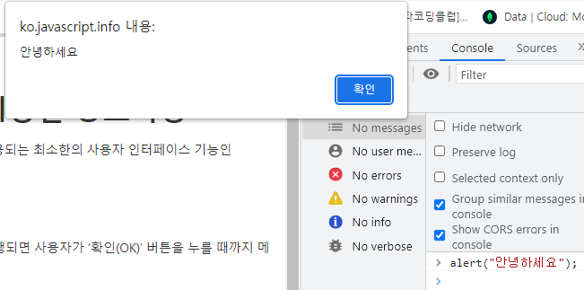

  - alert를 사용하면 그 확인버튼을 누르기 전 까지는 모든 동작을 정지시켜둔 채로 기다린다. (일시정지 같은느낌)
  
  ## prompt

  - 앞서 말했던 alert 창을 간단하게 조작할 수 있게 해주는 명령어
  - 기본 구조는
  ```javascript
    test = prompt(title, [deafult]);
  ```
  - 같은 구조를 띄고 있으며 여기서 title은 내용을 의미하고 [default] 값은 기본으로 설정된 값을 넣는다.

  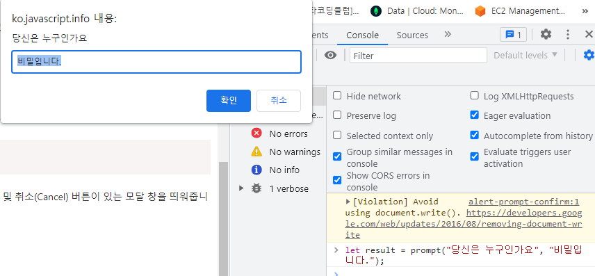
  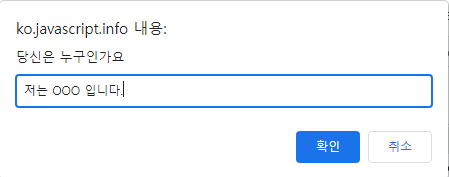
  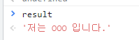

  - 입력을 취소할 경우 null 이 반환됨.

  ## comfirm
  
  - alert 창에서 좀더 간단하게만 수정된 버전으로 사용자에게 질문을 던지고 확인 / 취소 버튼이 존재하는 창을 띄워준다.
  - 확인 버튼을 누르면 true, 다른 버튼을 누르면 false를 반환한다.

  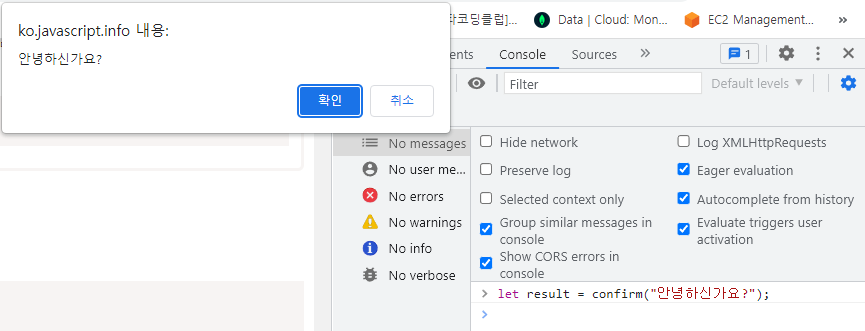
  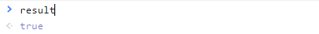
  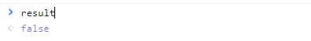

# 형 변환

  - 보통은 선언해주지 않아도 값을 입력하면 문자인지 숫자인지 다른 자료형인지 스스로 판단해서 값을 넣어준다.
  - 인위적으로 형을 수정해야 하는 경우 형 변환(type conversion)을 사용한다.

  ## 문자형으로 변환
  - 함수나 메서드에서 요구하는 변수를 넣어주고 그 내부에서 정해진 형으로 변환해서 작동한다.
  - 내가 원한건 문자형이지만 출력되어 나온 값이 정수형인 경우 문자형으로 변환해서 사용해야한다.
  ```javascript
    let value = 10;
    typeof value // "number"
    value = String(value); // String()을 통하여 강제적으로 문자형으로 변환시켜준다.
    typeof value // "string"
  ```
  - 문자형으로 변환되는 경우 "" or ''가 붙어서 출력된다.

  ## 숫자형으로 변환
  - "0", 0 은 둘다 같은 0으로 보이지만 typeof 를 찍어볼 경우 str, int 로 다른 형태의 값들로 나오게 된다.
  - "1" > 0 은 성립할 수가없다. 문자열과 숫자열을 비교하는 것이기 때문에
  - 이렇게 문자열로 된 값을 비교하고 싶은 경우 숫자형으로 변환해서 비교를 해야한다.
  ```javascript
    let str = "1234";
    typeof str // string
    let num = Number(str) // Number()을 통하여 강제적으로 숫자형으로 변환시켜준다.
    typeof str // number
  ```
  - 또한 특이하게 '123', '1234', '1230' 등의 값을 제외한 문자 '12345 다음은?' 가 포함된 경우
  ```javascript
    let str = Number('123');
    let str1 = Number('1234');
    let str2 = Number('1230');
    let str4 = Number('12345 다음은?');
    typeof str // Number
    typeof str1 // Number
    typeof str2// Number
    typeof str3// NaN
  ```
  - 숫자 이외의 문자가 들어가있는 경우 반환값이 NaN 으로 정의할 수 없다는 결과가 나온다.

  ## 불린형으로 변환

  - 논리 연산을 수행할 때 자주 사용하며 Boolean(value) 를 통하여 변환이 가능함.
  - 0, Null, undefined, NaN 등 처럼 비어있거나 부정적인 값들을 나타내는 경우 false
  - 그 외의 모든 값은 true
  ```javascript
    Boolean(1); // 숫자 1(true)
    Boolean(0); // 숫자 0(false)
    Boolean("hello"); // 문자열(true)
    Boolean(""); // 빈 문자열(false)
    Boolean("0"); // true
    Boolean(" "); // true 공백도 한 문자로 취급
  ```

# 기본 연산자와 수학

  - 덧셈(+), 뺄셈(-), 곱셈(*), 나눗셈(/) 등을 의미
  - 자주 사용되는 연산자 단어들
    - 피연산자 : 연산을 수행할려는 대상을 의미함. ( 10 * 2 의 경우 10과 2가 피연산자에 해당)
    - 단항 : 피연산자를 한개만 받는 연산자
    - 이항 : 피연산자를 두개받는 연산자
    ```javascript
      let x = 1;
      x = -x // 단항 연산자
      let y = 3;
      console.log(x + y) // 이항 연산자 x,y 를 받아서 연산해줌
    ```
## 연산자 종류
    
  1. 덧셈 연산자(+)
    
  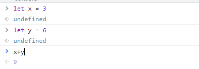

  2. 뺄셈 연산자(-)
    
  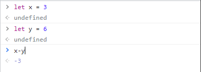

  3. 곱셈 연산자(*)
  
  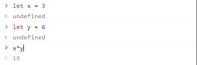
  
  4. 나눗셈 연산자(/)
  
  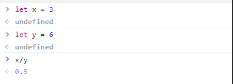
  
  5. 나머지 연산자(%)
  
  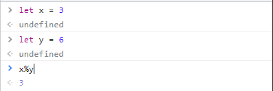
  
  6. 거듭제곱 연산자(**)
    
  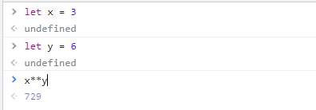

## 이항 연산자 "+" 문자 연결

  - 기본적으로 + 연산은 정수형끼리의 결합을 의미한다.
  - 문자 + 문자로 문자열을 결합해줄 수 있고 문자 + 숫자는 문자열로 나타내준다. 여러가지 예시를 들어보자
  ```javascript
    let name = "my" + "name";
    console.log(name); // myname
    console.log(1 + "5"); // "15" string
    console.log("5" + 5); // "55" string
    console.log(4 + 4 + '2') // "82" string
  ```
  - 숫자들 끼리 더한 후 문자열을 뒤에 합쳐주는 방식으로 결과를 출력해내는 것을 볼 수 있다.
  - 외에도 다른 연산자를 사용할 경우
  ```javascript
    console.log( 10 - "3") // 7 "3"을 숫자로 바꾼 후 연산이 진행
    console.log( "10" / "2") // 5 두 연산자가 숫자로 변경되어 계산됨
  ```

## 단항 연산자 + 와 숫자형 변환

  - 단항 연산자로도 사용이 가능하다.
  - 숫자형 외에 다른 자료형에 단항 연산자를 적용하면 피연산자가 숫자형으로 변형이된다.
  ```javascript
    console.log(+true) // 1
    console.log(+"") // 0

    let red = "1";
    let blue = "2";

    console.log(red+blue); // "12" 가 출력된다.
    console.log( +red + +blue ); // 3이 출력된다
  ```

## 연산자 우선순위

  - 모든 연산함에 있어서 기본적으로 우선순위를 이해해 두는 것이 편하다.
  - 모든 문법에서 연산자 우선순위에 의해서 코드의 실행방식이 변경되기 때문에 한번 외워두면 다른 언어를 배울때도 간단하게 적용할 수 있다.

  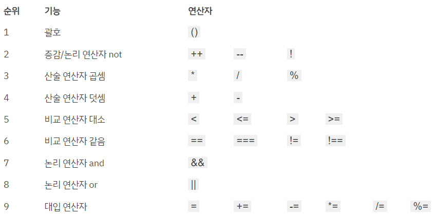

  - 자주 사용하는 연산자들의 우선순위 정도는 알아두면 좋다.

## 할당 연산자
  
  - 무언가에 값을 할당하기 위해 사용하는 연산자로 앞에서도 많이 사용했던 "="을 사용한다.
  - 프로그래밍 언어에선 "="를 사용하면 오른 쪽의 피연산자를 왼쪽 피연산자에 값을 넣는다는 의미로 사용이 되고 있다.
  ```javascript
    let a = 5;
    let b = 2;
    let c = 10 + (a + b);
    console.log(c); // 17
  ```
  - 여러 개를 연결하여 할당할 수 있다.
  ```javascript
    a = b = c = 4 + 2;
    console.log(a); // 6
    console.log(b); // 6
    console.log(c); // 6
  ```

## 복합 할당 연산자

  - 같은 변수에 값을 더해나가는 방식의 코드를 자주 접하게 될 것이다.
  - 이때 그 값에 수를 더해주거나 곱해주거나 하는 방식을 복합 할당 연산자라고 부른다.
  ```javascript
    let x = 2;
    x = x + 5;
    // 변환하면
    x += 5;

    // 외에도

    x = x * 5;
    // 변환
    x *= 5;
  ```
  - 위와 같은 식으로 사용할 수 있다.

## 증감 연산자

  - 숫자를 하나 늘리거나 줄이는데에 사용된다.
  - 연산자의 위치를 어디에 붙이느냐에 따라서 계산하기 전에 증감하는지 계산한 후에 증감하는지가 결정된다.
  
  - 전위형(prefix form)
    - ++x 와 같이 피연산자 앞에 연산자가 오는 경우 (--x)
    ```javascript
    let x = 1;
    let y = ++x;
    console.log(y); // 2
    console.log(x); // 2
    ```
  
  - 후위형(postfix form)
    - x++ 와 같이 피연산자 뒤에 연산자가 오는 경우 (x--)
    ```javascript
    let x = 1;
    let y = x++;
    console.log(y); // 1
    console.log(x); // 2
    ```

  - 전위형 연산자의 경우 연산을 한 값을 넣어주고 후위형의 경우 값을 넣은 후 연산이 시행된다.

## 비트 연산자

  - 값들을 32비트의 정수로 변환하여 이진 연산을 시행한다.
  - 거의 사용이 되지 않지만 알아두면 좋다.
  - 종류
    1. AND ( & )
    2. OR ( | )
    3. XOR ( ^ )
    4. NOT ( ~ )
    5. LEFT SHIFT ( << )
    6. RIGHT SHIFT ( >> )
    7. ZERO-FILL RIGHT SHIFT ( >>> )

# 비교 연산자
<!-- 2.9 -->
  - 값들을 비교하여 어느 값들이 더 큰지 작은지 판단하는 것이고 이를 바탕으로 조건등을 설정하기 위해 사용한다.

## 불린형 반환

  - return 되는 값이 true이면 "참", false이면 "거짓"
  ```javascript
    console.log( 2>1 ); //true
    console.log( 2 == 1 ); //false
  ```

## 문자열 비교

  - 사전의 순서대로 문자열은 비교를 시행한다.
  ```javascript
    console.log( "Z" > "A" ); // true
    console.log( "Glow" > "Glee" ); // true
    console.log( "Bee" > "Be" ); // true
  ```
  - 첫 글자를 비교한 후 같을 경우 그 다음 문자열을 비교 하는 식으로 참 거짓을 판단해 나감

## 다른 형을 가진 값 비교

  - 문자열과 숫자열 처럼 다른 형태의 값들을 비교도 가능하다.
  ```javascript
    console.log( "2" > 1 ); //true 문자 2를 숫자로 변경하여 비교가 진행된다.
  ```

## 일치 연산자

  - 동등 연산자 "=="의 경우 0과 false를 구분하지 못한다.
  ```javascript
    console.log( 0 == false ); // true
    console.log( "" == false ); // true
  ```
  - 동등 연산자가 형이 다른 피연산자를 숫자형으로 바꾸기때문에 제대로 값을 비교하지 못하게 되는 경우가 발생한다.
  - 이 경우 일치 연산자인 "==="을 이용하여 값을 비교하는 것이 좋다.
  - 일치 연산자는 형의 변환이 없이 값을 비교하기 때문이다.
  - 엄격한 동등 연산자라고 불리며 값들의 자료형까지 비교하기 때문에 형이 다른 것을 판단해준다.
  ```javascript
    console.log( 0 === false ); // false
    console.log( "0" === 0 ); // false
  ```

## Null 이나 undefined 비교
  
  - null 과 undefined의 경우 둘다 부정의 값을 나타내기는 하지만 비교로 들어가면 다른 속성을 가진다.
  - null의 경우 숫자형으로 변환시 0의 값을가지지만 undefined는 NaN으로 변하게 된다.
  - null은 다른 숫자형들과 비교시 0의 값을기준으로 비교가 진행되지만 undefined는 NaN으로써 값으로 비교가 불가능하다.