# 2.10 if와 "?"를 사용한 조건 처리

  - 조건문(if)를 왜 사용하는건가? 어떠한 작업을 수행하며 원하는 결과를 도출해내기 사용함.
  - 조건에 따라서 다른 결과값들을 나타내며 if 와 "?"라는 조건부 연산자를 사용한다.

## if 문

  - 기본형식
```javascript
    if([여기에조건]) {
        실행할 내용;
    }
    else {
        실행할 내용;
    }
```

  - 소괄호 안의 내용이 True 일 경우 아래 블록을 실행하고 False인 경우 else 문을 실행한다.
  - 실행할 내용이 한줄일 경우 '{}'를 생략이 가능하지만 가독성을 위해서 '{}'를 사용하는 것을 습관화 하자.
  - if문의 결과값은 불린형으로 True or False로 반환된다.

```javascript
    if(0) {
        실행될까?
    }
    // 실행되지 않는다 0은 false 값을 가지기 때문에 if문은 true일 경우에 실행된다.
    if(3) {
        실행될까?
    }
    // 이값은 실행된다. "",null,undefined,NaN,0 을제외한 값들은 모두 True로 인식힌다.
```

  - if 문에서 false가 나온경우 else 문을 처리하여 해결해준다. 

```javascript
    if (0) {
        console.log("hi");
    }
    else {
        console.log("bye");
    }
```

  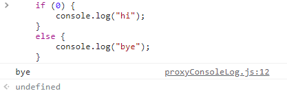

  - 조건을 좀더 세세하게 나누고 싶은 경우는 else if 문을 사용한다.

```javascript
    if (age > 10) {
        console.log("10살 초과입니다.");
    }
    else if (age > 20) {
        console.log("20살 초과입니다.");
    }
    else {
        console.log("10살 이하입니다");
    }
```

  - 이렇게 else if 문을 사용하여 조건을 나눌 수 있다.
  - 주의할 점은 조건의 시작점을 큰수로 조건을 거는 것이 좋다.
  - 만약 25를 입력할 경우 결과값으로는 "10살 초과입니다" 가 나오게 된다.
  - 코드가 실행되는 방식이 if 문을 거치고 그 값이 false일 경우 아래로 돌기때문에 조건을 걸때는 큰수를 기준으로 잡는 것이 좋은 방법인 것 같다.

## 조건부 연산자 "?"

  - 기본적인 조건문은 "if"로 구성되지만 코드를 좀 더 간결하게 작성이 가능하다.
  - 조건부 연산자 "?"를 사용하여 "if"문의 코드를 간결하게 나타낼 수 있다. (삼항 연산자라고도 부름)

```javascript
    let result = condition ? value1 : value2;
    // 여기서 기준이되는 대상이 ? 앞에 있는 condition 그리고 결과값이 True일 경우 value1을 False인 경우 value2를 반환해준다.
    let accessAllowed = age > 18 ? true : false;
```

  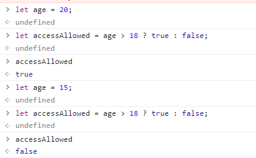

## 다중 "?"

  - "?"연산자를 여러 개 연결하여 복수의 조건을 처리함.

```javascript
    let age = 30;

    let message = (age < 3) ? "몇살이세요?" : (age < 18) ? "안녕?" : (age < 100) ? "정상" : "나이가..?"
    console.log(message);
```

  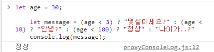
  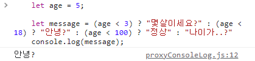

  - "?"연산자를 항상 사용하는 것이 좋은 방법은 아니다.
  - 상황에 맞게 if 문과 조건부 연산자 "?"를 번갈아 가면서 사용해야한다.
  - 복잡한 조건의 경우 if 문을 사용하는 것이 간단한 조건의 경우 "?"를 사용하는 것이 가독성 면에서 좋은 장점을 가진다.

# 2.11 논리 연산자

  - 모든 언어에는 논리 연산자가 존재하며 보통 ||(OR), &&(AND), !(NOT)등이 있다.

## ||(OR)

  - OR 연산은 보통 둘중 하나의 의미로 사용되고 "||"로 표현한다. (Enter Key 위에있음)
  - OR 연산은 둘중 하나의 값이 True일 경우 True를 return하는 구조를 가지고있다.

  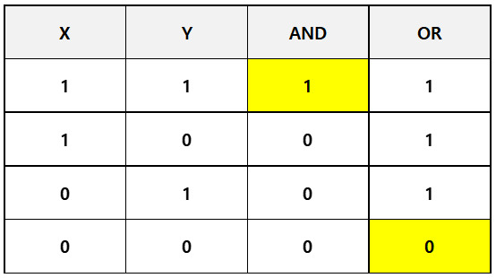

```javascript
    let num = 12;
    if ( num < 10 || num > 16 || true) {
        console.log("출력되나?")
    }
```

  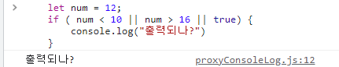

  - 12라는 값을 가지고 조건문을 통과하지 못하지만 true라는 값이 한개 존재하기 때문에 값이 출력된다.
  - 좀 더 복잡한 식으로 연산자를 만들 수 있다.

```javascript
    test = value1 || value2 || value3;
```

  - 위와 같은 구조는 value1 부터 value3 까지 값을 비교해 나가는 구조를 가진다.
  - 이들 중 true 값이 한개라도 존재할 경우 처음으로 나온 true 값을 돌려준다,
  - true 값이 한개도 없는 경우 맨 마지막 값을 return 해준다.

## &&(AND)

  - AND 연산은 두개의 값이 모두 True 일 경우 True를 return하는 구조를 가지고있다.

```javascript
    let num1=10;
    let num2=20;
    if (num1===10 && num2===20) {
        console.log("확인됐습니다");
    }
```

  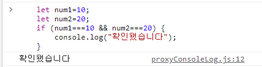

  - AND 연산도 OR연산과 유사한 방식으로 동작하지만 AND 는 모든 연산자가 True 경우 마지막 값의 결과를 가져오고 모든 값이 False인 경우 첫 연산자의 False 값을 가져온다

  - &&연산자 사용시 주의할 점은 연산자의 우선순위를 조심해야한다.
  - && 연산의 우선순위가 || 연산보다 높기 때문에 같은 문장안에 있을시 실행되는 순서는 && 연산이 빠르다.

```javascript
    a && b || c && d 의 결과는 (a && b) || (c && d) 와 동일함
```

## !(NOT)

  - NOT 연산자는 내가 가진값의 결과를 반대로 출력한다고 보면 된다.
  - True 를 가졌으면 False로 반대로 False를 가졌으면 True로 값을 return 해준다.
  - !!두개를 사용하면 값을 Boolean 형태로 변경시켜준다.
```javascript
    console.log(!true);
    // false
    console.log(!false);
    // true
    console.log(!!"hi~");
    // true !!두개를 사용하면 Boolean 형으로 변경가능함.
```

# 2.12 nullish 병합 연산자 "??"

  - 최근에 추가된 문법으로 짧은 문법을 통하여 여러 피연산자 중 값이 확정된 변수를 찾아주는 역할을 한다.

```javascript
    let one = null;
    let two = undefined;
    let three = "세번째값";
    console.log(one ?? two ?? three ?? "네번쨰");
    // 세번째값
```

  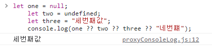

  - 역할을 보면 || 연산자와 비슷한 역할을 하는 것 같다.
  - 실제로 동작은 || 연산자는 첫번째 true 값을 돌려주는 역할을 하지만 ?? 연산자는 확정된 값을 돌려주기 때문에 동작방식이 비슷해 보여도 구조는 다르다는걸 알고있어야한다.

## 연산자 우선순위

  - 연산자들 간의 실행되는 순서를 말하며 실제로 사용해가며 직접 익히는 것이 좋다.

  

# 2.13 while과 for 반복문

  - 같은 동작을 여러번 반복하거나 값들을 순서대로 출력할때 사용하는 방법.
  - 반복문의 종류는 while 과 for 문이 존재한다.

## while

  - 사용하는 방법은 횟수가 정해져 있거나 하지않고 몇번을 반복해야할지 모를 경우 자주 사용됨.

```javascript
    while (조건식) {
        실행할 내용
    }
```

  - 기본적인 구조는 위와 같은 구조를 가지고 있으며 조건식의 값을 넣어서 반복문을 제어하는 방식을 취한다.
  - do...while 구조의 반복문도 존재하며 이는 결과를 먼저 실행한 후 조건식을 검토하는 while문이다.

```javascript
    do {
        실행할 내용
    } while (condition);
```

  - 어떠한 반복문을 실행을하는데 조건식을 확인하는 것을 제일 마지막에 하며 반복문의 내용을 최소한 한번 이상은 실행시킬 때 사용한다.
  - 사용하는 빈도가 거의 드물어 그냥 존재한다는 것만 알아두면 좋다.

## for
  
  - 반복되는 횟수가 정해져 있을때 사용하는 반복문
  - 제일 사용되는 빈도가 높은 반복문으로 자주 접하게될 반복문이다.

```javascript
    for (let 변수명; 변수의 실행범위; 변수의 상태조정) {
        반복해서 실행할 내용
    }

    for (let i; i<list.length; i++ or i--) {
        반복해서 실행할 내용
    }
```

  - 위와 같은 구조를 가지고 있으며 반복되는 횟수를 지정해서 사용하는 방식으로 while 과는 다르다.
  - "변수명"은 반복문이 처음 동작할때 시행되고, "변수의 실행범위"는 "변수명"이 어디까지 실행되는지, "변수의 상태조정" 부분은 반복문이 한번 끝났을 때 "변수명"을 조작하는 연산자를 말한다. (후위 연산자 ex=> i++ or i--)

## 그 외 기능들

  - 반복문을 반복횟수를 실행하지 않고 탈출하고 싶을 경우 "break"를 넣어주면 반복문을 즉시 중단시킬 수 있다.
  - 이를 조건식과 활용하여 사용이 가능하다.

```javascript
    let a = 0;
    while(true) {
        a += 1;
        if (a > 10) {
            break;
        }
    }
```

  - 조건문과 사용하여 while 무한반복문을 돌리고 a값에 1씩더해가며 그 값이 10을 넘었을 경우 반복문을 종료하는 방식으로 원하는 조건일때 내가 제어를 할 수 있게 해준다.

  - "break"의 약한 버전으로 "continue" 가 있으며 "continue"의 경우 조건식을 통하여 현재 실행중인 반복횟수를 건너뛰는 방법으로 사용된다.

```javascript
    let a = 0;
    while(true) {
        a += 1;
        if (a % 2 === 0) {
            continue;
        }
        console.log(a)
    }
```

  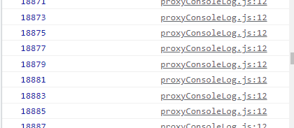

  - a 값이 짝수인 경우 "continue"를 통하여 반복문을 종료시키고 다음 반복횟수로 넘겨줬다.
  - "break"와 "continue"의 차이를 확인하고 각각의 쓰임새에 맞도록 사용하자.

# 2.14 switch 문

  - if 문과 비슷한 조건문으로 switch 문의 경우 특정한 변수를 다양한 상황에 비교할 수 있게 해준다.
  - 기본 구조는
```javascript
switch(x) {
  case "test1": // if (x === "test1")
    ...
    break
  case "test2": // if (x === "test2")
    ...
    break
  default:
    ...
}
```
  
  - 같이 구성되어 있으며 기준이 되는 변수 x의 값이 case 에 설정된 값이랑 비교하여 같으면 실행하고 아닌 경우 아래로 내려가는 구조로 이루어 져있다.
  - 기본적으로 break를 넣어줘야 하며 넣어주지 않을 경우 조건에 부합하는 부분부터 아래 부분이 모두 실행되어 출력된다.

```javascript
  let x = 10;
  switch(x) {
    case 9: {
      "값이 작습니다";
    }
    case 10: {
      "값이 같습니다";
      break;
    }
    case 11: {
      "값이 큽니다.";
    }
    default: {
      "일치하는 값이 없습니다.";
    }
  }
```

  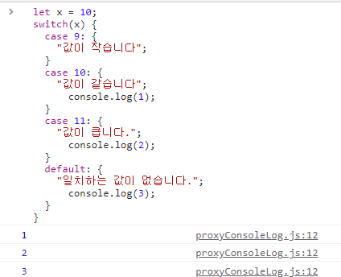

  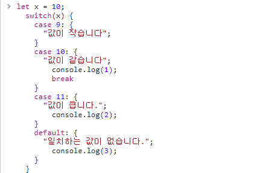

  - break의 유무에 따라 코드가 멈추고 동작하는 값이 다르므로 꼭 break를 사용해야 한다.
  - 다른 case 문을 묶어서 사용도 가능하다.

```javascript
  let x = 10;
  switch(x) {
    case 9: {
      "값이 작습니다";
    }
    case 10:
    case 15: {
      "값이 같습니다";
      break;
    }
    case 11: {
      "값이 큽니다.";
    }
    default: {
      "일치하는 값이 없습니다.";
    }
  }
```

  - 항상 값들을 비교하거나 조건으로 제약을 사용할때는 자료형이 중요하다.
  - 1과 "1"이 다른 것처럼 문자열과 정수형의 값들을 비교할때 이 부분을 주의해서 사용해야한다.

# 2.15 함수

  - 코드를 작성하다 보면 유사한 동작을 하는 코드를 여러군데 똑같이 사용하면 번거롭기도하고 귀찮다.
  - 함수로써 반복되는 코드들을 선언하여 불필요한 반복을 줄일 수 있다.

## 함수 선언

  - 기본적으로 내장된 함수 외에도 우리가 직접 함수를 만들어 사용할 수 있다.

```javascript
  function myfunction() {
    console.log("Hi")
  }
```

  

  - 함수를 선언할때에는 매개변수를 사용하여 변수를 조작할 수 있다.

```javascript
  function myfunction (num1) {
    console.log(num1);
  }
  let x = 10;
  myfunction(x);
```

  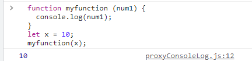

  - 매개변수는 하나의 값뿐만 아니라 여러개의 값을 가질 수 있으며 실제로는 함수 내부에서 사용되는 변수를 의미한다.
  - 또한 함수 내부에서 사용된 변수들은 함수 외부로 값을 가져갈 수 없으며 이러한 변수들을 지역 변수라고 말을한다.
  - 지역변수는 그 지역(함수)내부 에서만 동작하고 외부로 나오면 아예 없는 존재로 인식된다.
  - 지역변수가 존재하면 그 지역밖의 변수들도 존재하는데 이를 외부변수(전역변수)라고 부른다.
  - 외부변수는 지역변수와는 다르게 함수 내부에서도 참조가 가능하고 함수 외부에서도 사용이 가능하다.

```javascript
  let test = "Hello";

  function myfunction() {
    let num = "world";
    console.log(test + num);
  }
  myfunction();
  console.log(test);
  console.log(num);
```

  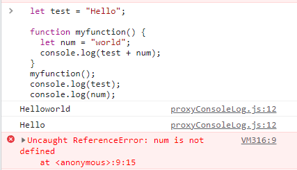

  - 만약 외부변수가 선언되었는데 함수를 실행하는 내부에 변수로 외부변수명을 사용할 경우에는 그 외부변수의 값이 변하게 된다.

```javascript
  let test = "Hello";

  function myfunction() {
    test = "apple";
    let num = "world";
    console.log(test + num);
  }
  console.log(test);
  myfunction();
  console.log(test);
```

  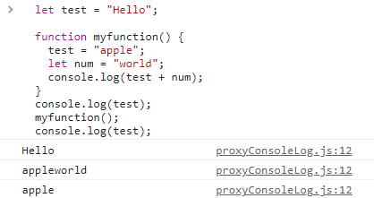

## 매개변수

  - 함수안의 데이터를 전달하는 역할을 하는 변수 인자(parameter) 라고 불린다.

```javascript
  function myfunction(test1, test2) {
    console.log(test1,test2);
  }
  myfunction("Hi","I'am");
```

  - 이렇게 함수를 생성시 매개변수를 "test1", "test2" 생성하였고 함수를 호출할때 그에 대응되는 값들을 넣어줘야한다.
  - "test1"에는 "Hi"가 들어가고 "test2"에는 "I'am"이 들어가서 "Hi I'am"이 출력된다.

  - JS에서는 매개변수의 갯수가 2개인 경우 값을 1개만 넣으면 나머지 다른값을 undefined 처리를 해서 출력해준다.
  - 매개변수의 개수가 부족하거나 초과를 하면 초과하거나 부족한 만큼의 부분을 undefined 처리를 해서 출력해주기 때문에 따로 오류가 발생하거나 하진 않는다.

## 반환 값

  - 함수에서 선언된 값들의 계산 혹은 결과를 직접 가져와서 사용하고 싶은경우 "return"이라는 방법을 사용해서 값을 반환해준다.
  - 함수는 내부변수를 이용하여 값을 계산하기 때문에 그 계산한 값을 앞에서는 console.log 혹은 alert로 띄우는 형식으로 진행을 해줬다.
  - 계산 혹은 진행한 값을 가져와서 변수로 다루고싶을 경우 함수내부에서 return 을 사용하여 값을 반환해서 외부변수에서 값을 다룰 수 있게 해준다.

```javascript
  function myfunction(num1, num2) {
    return num1+num2;
  }
  function myfunction2(num3, num4) {
    return num3*num4;
  }

  let x = 10;
  let y = 20;
  let z = 0;
  let a = 0;
  a = myfunction(x, y);
  z = myfunction2(x, y);
  console.log(a);
  console.log(z);
```

  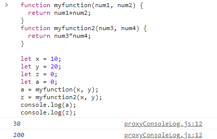

  - 앞에서 말했던 내용 중 변수들의 이름을 지을때는 그 변수가 무엇을 담고있는지 변수명을 설정하는 것이 중요하다고 했었다.
  - 함수도 마찬가지로 이 함수가 어떠한 동작을 하는지를 이름으로 지어두면 다른 사람들이 보기에도 어떠한 동작을 하는 함수인지 이해하기가 쉽기 때문에 함수의 이름을 정하는 방법도 함수의 특징혹은 함수가 담고있는 값으로 설정하는 것이 중요하다.

# 2.16 함수 표현식

  - JS에서는 함수를 특별한 종류의 값을로 취급한다.
  - 생성한 함수를 변수에 할당하여 함수를 다룰 수 있음.
  - 함수를 실행하기 위해서는 ()를 꼭 붙여서 사용해야한다.

```javascript
  function myfunction(question, yes, no) {
    if (confirm(question)) {
      yes()
    }
    else {
      no()
    };
  }

  myfunction ("배고프다.", function yes() {
    alert("배고파~"); }, function no() {
    alert("안고파");
  })
```

  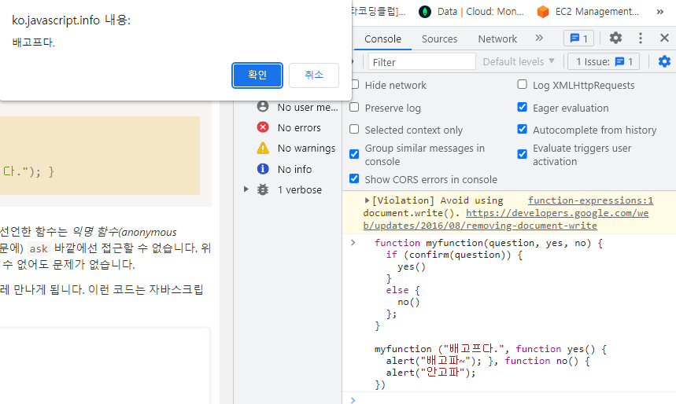

  - 함수 표현식과 함수 선언문은 큰차이를 가지고있다.
  - 코드의 실행특성상 위에서 아래로 내려가면서 코드를 실행하기 때문에 변수가 선언이 되어야 그 값들에 대한정보를 가지고있다.
  - 함수 선언문의 경우는 코드내부 어느 위치에 있어도 그 함수를 참조할 수 있지만 함수 표현식의 경우는 변수에 값을 할당해야지 그 함수가 존재하기 때문에 이러한 참조할 수 있는지가 큰 차이점이라고 할 수 있다.

```javascript
  console.log(test(2,5))

  function test(a,b) {
    return a+b;
  }
  console.log(test1(2,5))
  let test1 = function x(c,d) {
    return c*d;
  }
  console.log("함수 이후 시행");
  console.log(test1(2,5));
```

  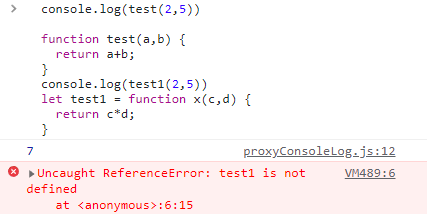

  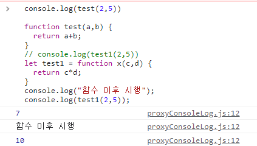

  - 무엇을 사용하는게 좋냐는 기준은 없고 그저 스스로가 판단해서 선언문을 사용하는것이 좋을것인지 표현식을 사용하는 것이 좋을것인지 경험에 의한 것 밖에 없다.
  - 가독성을 생각한다면 선언문이 좋을 것 같다.

# 2.17 화살표 함수 기본

  - function 을 사용하여 생성하는 함수를 좀더 간결하게 표현하기 위한 식

```JS
  let func = (a, b, c) => {}
```

  - 생김새를 가져와서 "=> {}"을 이용하여 생성한다.
  - 여러값을 가져와야 하는 경우 기존의 함수와 동일하게 작성해주면 된다.

```JS
  let test = (a,b) => {
    return a*b;
  }
  console.log(test(10,5));
```

  - 함수를 표현하는 방법을 간결하게 나타낸 것이므로 다른 함수와 기능이 다르지는 않다.